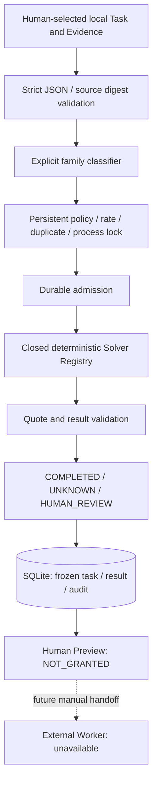

# Architecture / capability boundary v0.1

## Flow

`model.py` は入出力契約、`solvers.py` は純粋な4種のSolver、`state.py` は永続化とpolicy、
`engine.py` は実行順序、`__main__.py` は単発CLIです。Runtime依存はPython標準ライブラリだけです。
family名はTaskの明示的な処理依頼として解釈します。任意module名、関数名、コマンド、URLへは解決しません。
Solver内でもparams・source・文法を再検証し、依頼文の部分一致や意味推測を行いません。

## Result / Evidence

Result envelopeはschema version、task ID、task digest、重複判定fingerprint、Solver ID/version、
dry-run、outcome、限界表示を含みます。envelope全体のdigestを別に記録します。
outcomeは `status`, `reason`, `value`, `verdict`, `evidence` を共通schemaとして使います。
上位Worker/Judgeを追加する場合にもUNKNOWNを誤ってMISMATCHへ変換しないことが必要です。

`exact.match` のMATCH/MISMATCHは文字列等価の結果だけです。他SolverはNOT_APPLICABLE、
UNKNOWN/HUMAN_REVIEWはUNDECIDEDで `value=null`。確率やconfidenceは付けません。
reference自体が正しいか、依頼者がreferenceを置く権限を持つかはこの版の判定外です。

各引用にはsource ID、UTF-8本文digest、locator、selectorとquoteを保持します。
selectorは全文、行範囲、JSON Pointerの3種類だけです。保存前および再読込時に固定sourceから再照合します。
JSON PointerのquoteはJSON値そのもので、boolとintを混同しないcanonical bytes比較です。
Batch 2では資料parse時に小数tokenをDecimalで保持し、選択部分に小数がない場合だけ抽出します。
選択部分の小数を文字列化・丸め・整数化して回答することはありません。引用照合にも同じ契約を適用します。
Task JSON自体は従来どおりfloatを拒否します。Solver versionは `json.extract@2` です。
UTF-8の署名bytes・JSON canonicalizationとの互換性は主張しません。これはローカルTask用の形式です。

## Persistent ledger

専用stateに `agent.sqlite` と `agent.lock` を置きます。SQLite journalを含むディレクトリ全体を保全します。
`synchronous=FULL`、DELETE journal、`BEGIN IMMEDIATE`、非blocking `flock` を使用します。
複数プロセスは同一stateの同時操作を拒否します。NFS、分散lock、別hostへの同期は未対応です。

| Table | 保存内容 |
| --- | --- |
| `policy` | rolling limit、concurrency=1、family enable/suspend/reason |
| `identities` | Human task IDと内容fingerprintの不変対応、別名も含む |
| `runs` | 固定Task、digest、Solver version、開始時刻、quota消費、Result/digest |
| `events` | 単調なseq、非減少時刻、種類、JSON payload、previous hash、自身のhash |

fingerprintは `task_id` 以外のTask全体から計算します。JSONの空白とobject key順は無視し、
source配列順・本文・locator・family・paramsを保持します。semantic duplicateは検出しません。
Result再利用時は元のResultを変更せず返すので、別名やdry-run指定でprovenanceを書き換えません。

開始とauditを同じtransactionでcommitしてからSolverを呼び、終了とauditを同じtransactionでcommitします。
lockを得た後の未終了runは、前プロセスがactiveでないことを確認できるため、HUMAN_REVIEWで終了させます。
成功Resultが保存された後の応答消失は次回duplicateで回収できます。保存前の中断は再計算しません。
テストでは開始保存後・終了保存前に子プロセスを `os._exit` で実際に終了しています。

毎回open時にSQLite quick_check、schema version、audit chain、policy、ID対応、run開始、終了digest、
固定Task、引用を照合します。状態が壊れていてもdefault policyへ戻しません。
ファイルのsymlink・hardlink・FIFOを拒否しますが、同一UIDの攻撃者による競合変更へのOS境界ではありません。

## Limits / bounded operation

rateはUTC時刻のrolling 3600秒／86400秒で、境界ちょうどの開始はwindow外です。
開始済みの既知Solverは失敗しても消費し、拒否・重複・dry-runは新たな通常実行枠を消費しません。
同時実行は1固定。数学は有限長整数のgcd/lcmだけで、任意評価・探索はありません。
最大10,000 runs／10,000 task ID／50,000 audit eventsで停止し、自動pruneはしません。
入力上限もありますが、長期運用向けのディスクquota・保持期間・索引最適化は次の設計です。
全audit照合は件数に比例するため、この版は無期限常駐・大量観測に向きません。
DB backup/restoreや別stateはlimitの範囲外なので、Human運用でstateを一元管理します。

dry-runもローカルauditを保存します。全CLI共通の起動時中断処理は行います。
入力JSONを解釈できない場合はraw bytes digestと理由だけをauditに残し、本文をそのまま反射しません。
サイズ超過や読取不能などdecode前のファイルエラーはCLI終了コード2で、Taskを受付しません。
concurrency拒否やDB異常時はauditへ書けないため、CLIエラーを返します。

## Trust / permissions

入力、source、URL、依頼者の自己申告はuntrustedです。資料にpolicy変更やimportを指示する文があっても実行しません。
信頼対象はこのRepositoryのコード、Python/SQLite、OS、ローカルHuman操作者です。
既存Solver実行経路にnetwork・subprocess・dynamic import・外部writeの実装経路はありません。
Batch 3では別コマンドのMaterial Resolverに限定HTTPS GETを追加しました。raw資料をfreezeし、
完全性の検査を通ったTaskだけを既存Agentへ渡します。Solverは再取得しません。
別の研究用collector `tests/collect_public.py` は固定された公開room読取URLだけにGETします。
redirect・cookie・認証・content由来URL・retry・write endpointは扱わず、Agent runtimeからimportしません。
これは悪意ある追加Solverや同一UIDからコード／DBを守るsandboxではありません。

audit hash chainは事故による改変や対応欠落の検知用です。外部署名・外部anchorがないので、
DB全体とchainの組織的書換えや整合したsnapshotへの巻戻しを防げません。
`preview` は確認資料で、ログイン認証・承認発行・署名権限を持ちません。
CCWのbroker、Claude/Codex launcher、Signer、Landlock/seccompは持ち込んでいません。

## Deferred choices

- Verified Answer Cache: source鮮度・Human verification・失効schemaが必要。同一Taskの不変Result再利用を先に実装。
- official-source fact extraction: Batch 3で限定した公式文書の取得provenanceとbytes digestを保存。
  JSON／行のHuman指定抽出は可能だが、自然言語質問からfactへの変換は未実装。
- reply template / relationship state: 返信／宛先選定がないため未実装。初回接触を自動化する権限もない。
- tclk: 公式 `5cc4ab93efbc8999a3a7e1471b639deca25998ea` を調査したが未組込。
  transcriptの署名、nonce、sender/frame対応、room、時刻、state foldを一部分だけ再発明しない。
  将来は固定した公式実装をPaperRail/read-only fixtureで検証してから追加する。
- External Worker: 手動handoffに必要なTask/Result/digestがPreviewにある。自動queue、LLM provider、課金経路はない。

External Write／Signer／Autopilotは別Gateです。今回の完了条件には含めません。

## Batch 3 Material acquisition

`material_fetch.py` のpath allowlist / public IP pinning / timeout / request・byte予算を経由し、
`materials.py` がfull-specと必要資料のgraphを検査してfreezeします。
`material_cli resolve` の取得と `material_cli run` のOffline評価を明示的に分離しました。
raw/stored/normalized digest、fetched timestamp、HTTP status、request・compiled Taskのdigestを保持します。
SQLiteの `material_handoff` eventで不完全Taskの見送りも記録します。
不整合・欠落資料からSolverを呼ばず、完全な資料でも未対応familyはUNKNOWNです。

`COMPLETE_WITHIN_SCOPE` は既知形式・参照についての保証だけで、署名や意味の正しさではありません。
validation本文の引用URL、delivery/sign/reveal指示は取得・実行の命令として扱いません。
cacheはrun内で同じURLの保存応答を再利用するだけで、freshnessを越えた事実として利用しません。
詳細のsource class、全上限、roomの範囲制約、再現方法は[Batch 3報告](material-resolver-20260919.md)。
