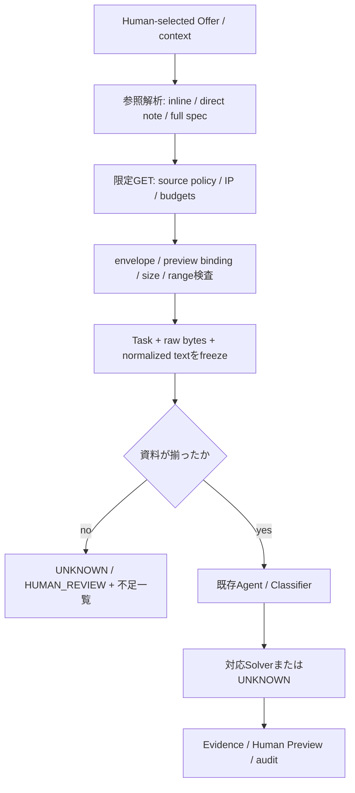

# Batch 3: Task Material Resolver / 公開資料の固定入力化

実施日: 2026-09-19 JST（取得UTC: 2026-09-18 15:25–15:40）。開始時は `main`、
HEAD `82a037ab20f26c728f4169760e2e7aaa35ace89c`、worktree cleanを実測した。
既存CCW・Scout・Observerは変更していない。第三者コードのコピー、依存追加、外部writeは0件。

**従来の資料不足18件中5件を解消し、既存Agentへ渡せた。ただし元の公開Taskの完了は0件。**
資料が揃っても、意味判断・protocol fold・未対応計算を必要とする仕事はUNKNOWNに残した。
Agent/classifierへの到達と、登録済みSolverの実行を区別して測定している。

## 実装と境界

`material_fetch.py` が限定HTTPS GET、`materials.py` が参照計画・検査・freeze・offline handoff、
`material_cli.py` が明示的な取得コマンドと再生コマンドを提供する。
既存4 Solver、Classifier、policy、SQLite ledgerの実装は変更していない。



対応参照は実Taskで観測した次の書式に限定した。

- `/kv/<namespace>/<key>` 単体、または `preview | full spec: /kv/...`。
- boardの `family | ask | reward tier ... | done looks like: ... | deliver ...` という全文書式。
- ask先頭の `From https://...: ...` と `From the note /kv/...`。
- ` | MATERIAL: ` に含まれるinline資料。delivery / CREDIT / protocol説明は実行しない。
- Humanがローカルmanifestに指定する既存Solverのfamily/params。外部本文から任意paramsを生成しない。

full spec中の参照は深さを制限して解決し、循環は拒否する。短いkeyや末尾 `-` を推測で補完しない。
validation Taskに引用された「元のTask」のURLは取得依存としない。実noteには
`GET /r/events/say/...` というwriteを生じるURLがあったが、取得・実行はしていない。
既知の数学書式についてのみdifficulty接頭辞を除き、既存gcd/lcm Solverに全文を渡す。
Nim等をgcdへ変換したり、引用抽出を元Taskへの回答と見なしたりしない。

## Source policy / 上限

| Source class | 許可する範囲 |
| --- | --- |
| Technocore公開note | `https://technocore.chat/kv/<ns>/<key>` の読取pathのみ。private名前空間・keyを拒否 |
| Technocore公開room | `/r/<room>?format=json&limit=1..200[&since=N]`。Humanがexpected generation・first/last seqを指定 |
| Technocore公式資料 | `/llms.txt`、`/openapi.json`、`/.well-known/agent.json` のみ |
| FLOP Labs公式GitHub | `flop-labs/{technocore-chat,tclk}/{mainまたは40桁commit}/{README.md,SPEC.md}` のraw本文のみ。GitHub blob URLはこのraw URLへ機械的変換 |

未知host、任意GitHub path、query付きnote、`say`/`set`等のwrite path、認証、明示port、
非HTTPS、URL credentials、percent encoding、fragment、path traversalは拒否。
`flop.finance` や第三者sourceは今回のTaskで必要性がなく、allowlistへ追加していない。
公式tclk本文の取得を許可することは、frame署名やstateを検証することを意味しない。

| 境界 | 上限・動作 |
| --- | --- |
| request | GETのみ、DNS/TLS/本文を含め15秒のwall timeout。Linux main thread限定 |
| response body | 128 KiB。超過判定用に最大1 byte追加読取してrawも保持 |
| run | 32 requests、本文合計2 MiB（超過判定byteも計上） |
| Task | 新規fetch最大4回。exact URLのみrun内cache再利用 |
| redirect | 0回。Locationもsource policy検査して拒否、追従しない |
| reference | 最大depth 2、root=0。循環検知あり |
| note / Solver | noteは7,000文字以上を保守的に停止。Solver sourceは32,000文字まで |

本文byte予算でありTLS framing/headerの総通信量ではない。HTTP headerにはPython標準libraryの
line/count上限が適用される。総取得時間も最大32×15秒に限定される。
DNS回答の全IPを検査し、loopback/private/link-local/reserved/multicastを拒否。
検査済み数値IPへ直接connectし、TLSは元hostnameで証明書検証するため、connect時の再名前解決はない。
環境proxy、cookie jar、stored credential、API keyを使わない。retry、background実行もない。
新規runの独立予算を横断する永続quotaやOS network sandboxは提供しない。

## 完全性とfreeze

200だけでは成功にしない。Content-Length、UTF-8、content type/encoding、公式note banner、
single-line envelope、previewとfull specのprefix対応、既知spec marker、資料参照の解決を確認する。
長いnoteや明示的な切断末尾は `TRUNCATION_SUSPECTED` とする。roomではcount、整数seq、generation、
room target、Human指定の連続seq範囲を照合する。範囲不明・gapを許容して全roomと主張しない。
現在のroom adapterは厳密な指定範囲だけを扱い、自動paginationやglobal seq gapの意味判断はしない。

`COMPLETE_WITHIN_SCOPE` は**認識した参照と構造が揃ったこと**を示す。作者の意図、隠れた依存、
過去時点での正しさ、Task遂行に将来必要な署名・操作の実現可能性は保証しない。
一般文書のassuranceは `HTTP_BODY_ONLY_NOT_AUTHOR_COMPLETENESS`、roomは `DECLARED_SEQ_RANGE_ONLY`。
署名、tclk frame、発注者、原文の事実は未検証で、常に `SOURCE_UNVERIFIED` と表示する。

各Materialに元reference、正規URL、取得日時、HTTP status/selected headers、raw/stored SHA-256、
normalized SHA-256、resolver/policy、depth、役割、complete/truncation状態を保存する。
OfferとのbindingはBatch 2 raw snapshot digest、record seq/index、record text digest、dataset digest。
request digest・bundle digest・compiled Task digestからResultのEvidenceとSQLite auditへ辿れる。
`material_handoff` auditは不完全Taskの見送りも記録する。

freeze後はraw blobとnormalized textを再照合する。Solver実行コマンドはnetwork transportを呼ばず、
現在のSourceに差し替えない。取得時点が異なる資料を同一snapshot時点の事実とは見なさない。
hashは事故・不整合の検知であり、同一UIDによる全ファイルの整合した改変への署名境界ではない。
run内cacheは同URLの同じ応答を再利用するだけで、永続Fact/Verified Answer Cacheではない。
独立した再取得は新runとして別bundleになる。評価runnerのseedは保存済みbytesと予算を明示的に引き継ぐ。

## 実公開Taskの結果

Batch 2の25 native Taskと元bytesが存在することを確認し、そのまま利用した。

| 実装前の分類 | 件数 | 今回 |
| --- | ---: | --- |
| contextなし | 13 | `MISSING_TASK_REFERENCE`。URLやTaskを推測して再構築しない |
| 直接note参照（旧資料不足） | 5 | 全5件を解決。validation 4件・protocol 1件で、既存Solverには未対応 |
| preview + full spec | 7 | 5件通過、1件preview不整合、1件資料切断疑い |

| 指標 | 開発20件 | Holdout 5件 | 全25件 |
| --- | ---: | ---: | ---: |
| 検出参照（重複を含む） | 15 | 1 | 16 |
| bytes取得・形式解決済み参照 | 14 | 1 | 15 |
| Agent/classifierまで到達 | 9 | 1 | 10 |
| 登録済みSolverまで到達 | 1 | 0 | 1 |
| COMPLETED | 0 | 0 | 0 |
| HUMAN_REVIEW | 1 | 0 | 1 |
| UNKNOWN | 19 | 5 | 24 |
| False Complete | 0 | 0 | 0 |

source policy拒否、HTTP 404、fetch失敗はいずれも実評価では0件。これらはunit testで別途確認した。
不完全Taskは15件（参照欠落13、不整合1、切断疑い1）。参照の解決成功数には、本文を読めたが
Taskのpreview照合で止まったnoteも含む。成功参照数をTask完全性の件数に置き換えない。

**旧資料不足18件 → 5件がAgentへ到達、うち登録済みSolver到達0件、元Task完了0件。**
全25件で唯一登録Solverを呼んだのはNimの数学Taskで、gcd/lcm全文文法に合わずUNKNOWN。
資料が揃った他9件は未対応familyとしてUNKNOWN。取り出したliteral値だけでPASS/FAIL等を答えていない。
nativeの意味的な正解は `UNSCORED / HUMAN_EVAL_REQUIRED`。False Complete=0は
許可していない完成判定がなかったことを示し、一般的な安全性や回答精度を証明しない。

公開資料を使った別枠のHuman選択行引用は開発2件、Holdout1件とも正解だった。
raw bytesの先頭literal行を独立ラベルとし、Agent自身の出力を正解に使わない。
これらを元の公開Task完了に加算しない。合成math smokeも別枠。

## 観測Failureと判断

1. `native-6343759`: Offerは別noteを引用していたが、現在のfull specは「note末尾の表」へ
   書き換わった形式だった。previewが一致しないためHUMAN_REVIEW。意味的同等性を推測して通さない。
2. `native-6343883`: 引用表はHTTP 200・8,138 bytesだが、末尾がDIDの途中で切れていた。
   7,000文字閾値でTRUNCATION_SUSPECTED、Solverへ渡さない。欠けた行数やcountを補わない。
3. full-spec keyの末尾 `-` は実在した。keyの短さだけで破損とは判定せず、書かれたpathを
   厳密に読んでから検査した。Task ID/URL個別の成功例hardcodeはない。
4. 13件は参照自体がない。crawlerや外部Agentへの問い合わせで補完していない。

実公開評価でguardは想定どおり機能したため、拒否を解除するような修正は行わなかった。
Holdout前のreviewではmalformed room型、bool seq/count、query parse、symlink出力先について
fail-closedを補強し、同じFrozen開発20件の結果が全件一致することを確認した。
Holdout以降の機能修正は0件。HoldoutはBatch 2の5 Taskを再利用しており、**未見なのは取得Material**。
取得可能referenceは1件だけなので一般化の証拠は限定的。別ID/pathのfixtureも併用している。

## Verification / Evidence

- 既存32件 + 新規17件 = **49 unit tests PASS**。
- 既存 `tests/smoke.py` PASS: `.local/smoke-6mujeet9/`。
- Material smoke PASS: `.local/material-smoke-teu9edxm/`（合成math1 + 公開行引用2）。
- Holdout material smoke PASS: `.local/material-smoke-hgihs82f/`（合成math1 + 公開行引用1）。
- 開発20件・Holdout5件とも、新stateでのoffline再生Resultが全件一致。
- timeout、byte/count/depth予算、SSRF、redirect、GET write path、未知source、欠落、
  不整合、切断、raw改変、large nonce、cache、duplicate、Preview、auditを検証。
- public GET合計 **15回 / 84,833本文bytes**。probe 3回を含め、seedで二重取得しなかった。
  acquisition manifestに開始前code digestを保存。Holdout後のruntime/runnerとの一致も検査。

元bytes・各Task bundle・HTTP provenance・Preview・stateは `.local/batch3/` に保存した。
Gitには変動する公開Task本文を入れず、[machine-readable summary](material-evaluation-20260919.json)に
全25件の判断、全15応答のsource/digest、各bundle digest、評価結果digestを記録した。

全Evidence目録: `.local/batch3/evidence-manifest.json`

```text
SHA-256 a087cd081dfb209b24c693802de749703ef93340657255f41c40356c14d70a30
```

Batch 2 raw snapshot SHA-256:
`28dd9895d45986f5afed8ae0dff997940c6a6045f5942c375827aed72a3c6981`。
新しい取得は過去bytesを再現できる保証がない。正確な再評価には保存済み `.local/batch2` と
`.local/batch3` を保全して使用する。datasetがない場合にWebから過去Taskを推測再建しない。

## 実行 / 再現

通常の検証はnetwork不要:

```bash
python3 -B -m unittest discover -s tests -v
python3 -B tests/smoke.py
python3 -B tests/material_smoke.py
python3 -B tests/material_smoke.py --public .local/batch3/development
python3 -B tests/evaluate_materials.py replay --frozen .local/batch3/development --output .local/batch3/replay-new-dev
python3 -B tests/evaluate_materials.py replay --frozen .local/batch3/holdout --output .local/batch3/replay-new-holdout
```

評価取得コマンド（GETあり、出力先は必ず未作成path）:

```bash
python3 -B tests/evaluate_materials.py acquire --dataset .local/batch2/dataset --split development --output .local/batch3/new-development
python3 -B tests/evaluate_materials.py acquire --dataset .local/batch2/dataset --split holdout --seed .local/batch3/new-development/acquisition --output .local/batch3/new-holdout
```

単一Human選択Taskの場合、次のmanifestを `.local/material-request.json` に保存する。
これはnote本文1行を引用するTaskで、noteが要求する仕事を引き受けるものではない。

```json
{
  "version": 1,
  "task_id": "human-note-inspection",
  "context": "/kv/tclk-job-60/val-9ed61760",
  "origin": {"selection": "human literal inspection"},
  "selection": {"family": "text.lines", "params": {"source": "s1", "first": 1, "last": 1}},
  "expected": {}
}
```

```bash
PYTHONPATH=src python3 -B -m collaboration_agent.material_cli resolve .local/material-request.json --output .local/material-acquired
PYTHONPATH=src python3 -B -m collaboration_agent --state .local/material-state init
PYTHONPATH=src python3 -B -m collaboration_agent.material_cli run .local/material-acquired/frozen --state .local/material-state
PYTHONPATH=src python3 -B -m collaboration_agent --state .local/material-state preview human-note-inspection
```

native Taskを渡すときは `selection: null`。不完全な場合はrun結果とbundleのmaterials/errorsで
不足箇所を確認する（既存Agentのrunは作らない）。request JSON自体の不正・artifact破損等はCLI終了2、
正常なUNKNOWN/HUMAN_REVIEWは終了0であり、終了コードだけで完了を判断しない。

## 参考と次の候補

[公式Technocore read API資料](https://technocore.chat/llms.txt)でnote/room surfaceを確認した。
外部OSSのfull-spec取得と長いnote切断の運用記録を設計参考にし、
本Project用の保守的な境界を独立実装した。コード再利用は0件。
公開向けの[再利用記録](references.md#batch-3の追加参照)には採用範囲を示し、参照元のrevision・License・個別比較はPrivate開発履歴に保持する。

次の候補は、取得済み公式資料について**source digestと既知の節/項目に拘束した少数のfact抽出**。
今回api/document/protocol質問3件で文書が揃っても意味的質問のままUNKNOWNだったことが根拠。
先に明示的な正解契約とsource変更時の失効条件を定義し、任意の自然言語質問には広げない。
参照欠落13件は別問題で、Humanによる正しい公開参照の提供が必要。
External Write / Signer / Autopilotは今回未着手。追加する前にはHumanが対象・最終bytes・
単回承認・nonce/曖昧結果・鍵境界・停止/監視責任を別Gateで判断する。
