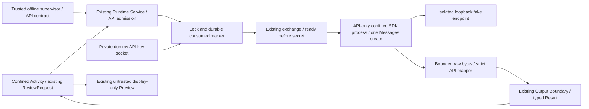

# Messages API Rail: 最小Offline Implementation

**Offline実装・検証完了。Real API disabled / Real Claude・Real API Gate NO-GO。**

開始状態は`main / 8d8dd57366bef4689e6b45b49dce3bf127c12d5e / clean`。
CLIのF-REAL-01はOpenのまま。APIの検証成功をCLI FindingのClosedに転用しない。
実provider、実key、setup-token、login、Console、課金、Production、VPS、systemd、Vault、
Signer、Wallet、Technocore、外部書込み、push / PR / publishは使用していない。
新たな依存取得・外部Docs取得も行わず、前回の公式SDKと記録を利用した。

## Architecture / Capability分離



`src/ccw/runtime_api.py`に固定contract、Cost Gate、単一SDK request、strict mapperを置く。
`runtime_api_launcher.py`はAPI独自のLandlock/seccomp profileと依存検証・ready-before-secretを持つ。
汎用provider framework、CLI wrapper、tool runnerは作らない。
Activityのinterfaceは既存ReviewRequest / RuntimeClientのまま。endpoint / model / credential / path等を
資料・requestから選ばせず、trusted supervisorが接続先Serviceを選択する。

APIの識別子は`runtime_kind=offline-messages-api`、`provider=anthropic-messages-offline-v1`、policy version 3。
CLIは従来の識別子・policy・launcherを維持する。API reportをCLI clientへ返しても拒否される。
共有部の変更はprovider許可値・期待provider照合とServiceの明示API分岐だけ。
Activity用interfaceにcredential/runtime importを追加していない。

Service入口は`runtime_service.py ROOT --api-offline-credential-fd FD`。
root作成と`prepare_offline`はtrusted supervisor用であり、Activity toolやReal permitではない。
既存lock、task照合、durable consume、匿名socket framing、bounded exchange、Evidence、Previewを再利用する。
CLI root / API rootは互換でなく、policyのroot・nonce・request全体・code manifestを照合する。
既存CLI契約も共有code hashを含むため、code更新前の契約を無条件継続できるとは扱わない。

## API contract / Cost Gate

| 条件 | 固定値・意味 |
| --- | --- |
| CCW invocation | 最大1回 / private Service instance |
| Humanが許可するattempt | 1回。今回のpolicyはoffline supervisorの合成許可のみ |
| Provider POST | 最大1、最小0。接続前失敗は0になり得る |
| Auxiliary request | 0。token count / auth refresh等を呼ばない |
| SDK / transport retry | 両方0 |
| Redirect / environment proxy | follow_redirects=false / trust_env=false |
| Fallback | provider / modelともなし |
| Client / request | fresh client、単一Messages create、stream=false、HTTP/1のみ |
| Model | `claude-sonnet-4-6` |
| Request input | 16,384 bytes。指示・保存sourceを含むcanonical引数と実wire body双方を検査 |
| Output tokens | max_tokens=128。価格・raw response byte上限とは別 |
| Raw response / Result | 65,536 / 32,768 bytes |
| Time | HTTP timeout 300ms、runtime wall timeout 5秒。Offline固定profile |
| Credential | Anthropic API key Rail。今回は`ccw-dummy-`＋48桁hexだけ |
| Cost | API課金はsubscriptionと別。real_spending_authorized=false |
| Accounting | provider_confirmed_usage / cost=null。事前resource budgetと別field |

SDK default任せにはしない。公開transport拡張点にsingle-use guardを置き、1回目の送出前にslotを消費する。
2回目、POST以外、指定Messages endpoint以外、異なるbodyやinput超過はHTTPTransportへ渡さない。
その下のtransport retryも0で固定する。transportが失敗してもslotを戻さない。
侵害済みSDKが別socketを直接使うことまでkernelでPOST1回に制限したわけではない。

現在のCLI側`max_attempts` / `automatic_retry` / `fallback`はCCW自身の契約である。
API側は`ccw_invocations_max`、`provider_post_max`、`sdk_max_retries`、`transport_retries`、
`follow_redirects`を別々に表示し、この差を曖昧にしない。

budgetは送出前のpolicy＋consumed markerで予約済みとなり、Evidenceでも予約量とrefund=falseを記録する。
timeout、credential failure、response拒否後も消費を戻さない。Evidence欠落でもconsumedが残れば再利用禁止。
providerの確定usage / costを事前budgetやfakeのusageから推測しない。実POST数も通常Evidenceではnullであり、
上限値1とfake endpointの観測値は別。今回の実測値はprobe summaryへ記録する。
金額計算・現行価格・課金設定は実装していない。

## Secret / Output / Isolation

API credentialをsubscription setup-tokenと混同しない。Activityにはcredential用FDを渡さず、
Serviceはconsumed永続化後に専用socketから読み、子が隔離してreadyを返した後だけexchangeが渡す。
constructorへのvalue引数に限定し、argv / environment / prompt / fileへ置かない。
SDKだけがfake endpointの認証headerへ使う。source resolver、Vault runtime access、refreshはない。
credentialはprovider側で1 task / 1 POSTに限定されるものではないため、Real Gateでscope / expiry / revokeが必要。

SDK response objectを信用せず、public transportからboundedなraw bytesをメモリ内で取得して別途decodeする。
duplicate key、UTF-8、Unicode scalar、message envelope、model、role、stop_reason、usage型、text blockを検査し、
既存`validated_result`によるreport schema / exact quote / secret scan / canonical Result上限へ接続する。
tool use / refusal / max_tokensによる未完了は拒否。非streamingへ予期しないSSEが返っても拒否する。
streaming、server tools、MCP、hooks、workspace discovery、CLAUDE.md読取りはこのAPI Railにない。

success / error bodyをSDK解析前に制限し、圧縮は展開前に拒否する。
secretはrawとdecode後、子のstdout/stderr、最終typed Resultで既存scanを再利用する。
raw response、prompt、credential、SDK例外本文をEvidenceへ保存しない。
成功結果もuntrusted / display_onlyで、命令風の文字列から外部Capabilityは発動しない。

子processは空のprivate workspace、read-only Landlock、TCP socketだけのseccomp、
exec / fork / FS write / UNIX socket / UDP socket拒否、core禁止、親死亡SIGKILL、CPU 10秒、AS 512MiB。
seccompのFIONBIO許可はAPI profile内だけ。sendmsg / SCM_RIGHTSも許さない。
Service・子の両方でloopbackしかinterfaceを持たないnetwork namespaceを要求し、endpointは127.0.0.1固定。
user namespace内でのローカル検証であり、host root / sudo / network設定変更はない。

## SDK / dependency

公式`anthropic==1.7.0`、`httpx2==2.13.0`、`httpcore2==2.13.0`等、前回評価済みの15依存を使用。
`messages_sdk.lock.json`に全version、公式配布URL、wheel SHA-256、installed RECORD SHA-256を固定した。
SDK wheel SHA-256: `6b681b6ee00f232bb54f50f9a0d6d30e7be368c1b6f754bfd470c8385b8b6058`。
provenanceは[前回の公式配布照合](messages-api-offline-assessment-20260920.md)を参照。

既存`.local/messages-sdk-20260920/venv`をoptional runtimeとして使う。通常unit testにはSDK不要。
自動download / install / upgradeやglobal dependency追加はない。
launcherはPython 3.12.3、distribution集合、RECORD identityと各hashed fileを照合してからSDKをimportする。
検証対象はlockの15依存について、固定RECORDのSHA-256と、RECORD内でhashがあるfileの
size / SHA-256 / venv内path、および検出されたdistribution名の集合。
**RECORD外のsite-packages fileを列挙・hash検証するものではない。** 許可集合の`pip`も
15依存のhash検証対象外。wheel SHA-256はprovenance記録であり、起動時にwheelを再取得・検査しない。
同一UIDでvenvを改変できる攻撃、検査後の置換、全import対象の閉包は保証しない（Dependency P3の範囲明確化）。
`-I -S -B`でsite / .pthの起動処理を抑止し、bytecode cache lookupを空workspaceへ向ける。
**`-B`単独では既存pycの読込みを抑止しない**ため、source hash検査だけでpycを実行しない工夫が必要だった。

lockは今回のLinux x86-64 / Python環境のinstall記録に対するもの。
別環境へ再導入する場合、wheel hashだけでなくgenerated script / RECORD差異のreviewも必要で、自動追従しない。
OS library / interpreter / 未隔離同UID supervisorを信頼する。sealed code / 全supply-chain監査の保証ではない。

## Verification

再現: `python3 -B tests/messages_api_probe.py --rail`。
旧probeのfake endpointとActivity confinementを再利用するが、API実装経路ではServiceの_executeをpatchしない。
実際の`runtime_service.py`→`runtime_api_launcher.py`→公式SDKを呼ぶ。
request methodをdispatch前に記録し、path、model、stream、認証一致boolean等だけ保存する。

| ケース群 | 件数 | runtime起動 | POST | GET / HEAD / その他 |
| --- | ---: | ---: | ---: | ---: |
| 正常 / 命令風data | 2 | 2 | 2 | 0 |
| HTTP 401 / 404 / 408 / 409 / 429 / 500 / 529 | 7 | 7 | 7 | 0 |
| timeout / POST後切断 | 2 | 2 | 2 | 0 |
| 接続前connection refused | 1 | 1 | 0 | 0 |
| 301 / 302 / 303 / 307 / 308 | 5 | 5 | 5 | 0 |
| malformed / field欠落 / refusal / tool / 予期しないSSE | 5 | 5 | 5 | 0 |
| secret plain / escaped / base64 | 3 | 3 | 3 | 0 |
| surrogate / bad report / wrong model / duplicate JSON | 4 | 4 | 4 | 0 |
| oversized success / oversized error / gzip | 3 | 3 | 3 | 0 |
| **計** | **32** | **32** | **31** | **0** |

成功2、拒否30。全32件でconsumed保持、同root再利用32回は追加runtime / POSTとも0。
HTTP errorにx-should-retry=trueも付けたが追加POSTなし。
継承環境へHTTP_PROXY / HTTPS_PROXY / ALL_PROXY（小文字も）とANTHROPIC_BASE_URL / dummy環境keyを注入したが、
proxy canaryの受信は0。正常responseでもconstructorのdummy keyだけがfake側へ届いた。

Gate拒否8件: STOP、contract改変、real_enabled=true、CLI policy、task不一致、credential FD欠落、
不正credential、code pin不一致。すべてPOST0。不正credentialのみadmission後のためconsumed維持・runtime0。
他7件はadmission前拒否。Real permit関数はHuman確認済みを模した引数でも無条件拒否するunit testを追加。
SDKを模した不正callerが2回目のrequestやHEADを要求してもtransportへ通さないunit testもPASS。

全unit test: **124件PASS / 49.926秒**（新規5件）。
READMEのisolation、通常Smoke、B1、Runtime Service、Secret Handoff / Boundary / ABC / consumer-windowもPASS。
既存CLI fake probeも20ケースPASS（20 CLI invocation / 22 POST / HEAD 20）。
statusは`PASS_OFFLINE_WITH_LIVE_BLOCKER`で、従来の内部SSE retryとF-REAL-01 Openを維持する。
初回のunit実行ではsandboxが匿名socket送信を拒否したため、承認済みlocal検証経路で再実行してPASS。
実装後probeは初回32件PASS。依存import固定とGate検証追加後に再実行し32件＋Gate8件PASS。
この2回のAPI probe合計は64 runtime起動 / 62 POST / auxiliary0。失敗修正loopはない。

Evidence（ignored、commitしない）:

- 最終API: `.local/messages-api-9e53ltjg/summary.json`
- 初回API: `.local/messages-api-gfezx44f/summary.json`
- 既存Smoke: `.local/smoke-0kkdquzt/`, `.local/b1-smoke-iledyzoz/`, `.local/runtime-service-smoke-oc3h514w/`
- Secret: `.local/secret-handoff-w7qiimcb/`, `.local/secret-boundary-8h2v97gk/`, `.local/secret-abc-4hhhl1h6/`, `.local/secret-consumer-window-l0wxswrt/`
- CLI fake regression: `.local/real-cli-1r65rby0/summary.json`

```text
final API summary SHA256: db9eb8106d2caff0dd10ee9a59174a4424ac735587cd0db640679b556d44edf9
SDK lock SHA256: 7df75d3f68e300114f629890dcad71f43104935b0bfcf9835a0c448ea3db82f9
```

## Findings / Residual Risk / Real Gate

- 新しいhidden retry / fallbackは観測なし。前回のredirect Findingには明示False＋transport guardで対応。
- bytecodeの読込みは-Bだけでは止まらない点を実装reviewで確認し、上記no-site / cache lookup固定を追加。
- mapperは意図的に狭いOffline subset。実APIのoptional field / usageの互換性は未完了で、未知fieldは拒否する。
- price / cost / 実accountのscope、expiry、revoke、TLS / DNS / Real egress、24H VPS運用は未検証。
- POST capはpin済みclientの経路の制約。侵害されたSDKの任意TCPをkernelが1 POSTへ制限する保証ではない。
- Python memory zeroization、未隔離同UID、任意encoding / partial-secret / covert channel完全検出の保証は追加しない。
- STOPはlaunch前に検査。in-flightはService/process groupを終了して照合し、consumedを戻さない。
  未確定attemptを新rootへ移して再送する運用も許可しない。

Real APIの入口・permit発行・key取得は実装しない。Real-enabled policy、実key形式、非隔離環境、
CLI契約の流用を拒否する。実keyを用意しても、このreleaseではReal APIを起動できない。
Real Gateを将来作る場合、API Rail選択、別課金、credential、model、input/output budget、POST最大1、attempt1、
untrusted output、network capability、停止/revokeをHumanへ提示し、最新公式価格・spend limitを別途確認する。

**次のHuman GO / NO-GO対象は、このOffline API Railを独立Security Reviewへ進めること。**
その判断はReal API実行・credential登録・課金設定の許可ではない。
