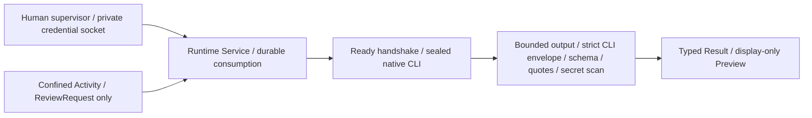

# Real adapter Offline Batch — 2026-09-19

**判定: Offline実装・検証済み、RealはNO-GO。** pin CLIの内部retryが設定0を迂回する重要Findingあり。
Independent ReviewだけでReal起動を許可できる状態には未到達。制限の緩和、新egress構成、binary更新は行っていない。
開始はmain / `b2f856fd3893e52156490f8b4b8a8345a5d2fe88` / clean。
Real provider、実credential、setup-token生成、login、Vault、Production、外部書込みは使用していない。

## 実装とHuman permit

`runtime_real.py`が既存Service、Secret Handoffの`exchange`、native launcher、CLI parser、
Output Boundaryを接続する。新しいActivity用実行Toolは登録しない。

将来用contractはroot・nonce・依頼全体digest・binary hash/version・model/effort・argv・明示code manifest・
timeout・budgets・TCP残Riskに結び付く。Human側の`prepare / permit / run`入口を実装したが、
`LIVE_BLOCKERS`によりpermit発行とService／native launcherでのpermit受理を拒否する。
環境変数、CLIフラグ、手製permitファイルで解除できない。旧Brokerと旧online launcherの停止も維持。
新しい修正・Offline検証・Independent Reviewなしに定数だけ削除してはならない。

通常のpermit検査はprivate owned 0600 file、root、contract digest、Human確認、期限を検査する。
issuerはHuman TTYとAgent環境／祖先拒否を再利用。消費markerはcredential受取とruntime準備より前にfsyncする。
同一instanceのlock／単回消費、post-execution failureで消費を戻さない処理を既存Serviceから共用する。
launcherもpermit・消費marker・service PID・code・argv・binaryを再検査する。
これはtrusted Human filesystemの境界であり、rootや任意の未隔離同UID processに対する署名承認ではない。

## Credentialと出力

master copyはHuman側。将来のHuman入口はhidden terminal inputからprivate socketへ渡すだけで、
実ファイル／既存login／環境／1Passwordを探索しない。現在はgateが先に拒否し、この入力にも到達しない。
ActivityのAPIにはcredential、path、endpoint、model、launcher、resolverを追加していない。
Serviceはnon-dumpable・core禁止。native launcherはsealed binary検査、Landlock/seccomp、stdio peer検査後に
readyを返し、匿名socketの先頭lineだけをcredentialとして読み、`CLAUDE_CODE_OAUTH_TOKEN`に設定する。
残りだけがCLIのprompt stdinとなる。tokenはargv・model入力に含まれない。
fake serverでAuthorization Bearerのdummy一致とbody非混入を確認した。実setup-tokenの互換性は未確認。

Human側Evidenceは固定status／failure分類／実行回数／消費状態等のみ。prompt、raw stdout、stderr本文、
credential、credential digest、providerの生errorは保存しない。Previewは既存ASCII JSONの表示専用。
受信時に両streamと既知secret表現を走査し、JSON escapeの展開後と最終Resultでも検査する。
独自暗号化・分割・部分secret・covert channelの完全検出を主張しない。

実CLIのJSON envelopeは、`type=result`、`subtype=success`、`is_error=false`、modelUsage等を
既存`claude_real.parse`で検証。`result`文字列を厳格JSON decodeし、review schema／引用を検証する。
構造化されたreport以外はActivityに返さない。二重final（`structured_output`併存）、未知field、
tool permission denial、agent活動、不正model、API error、malformed、oversized、bad Unicodeは拒否する。
CLIがAPI error時にも`subtype=success`を返すため、subtype単独／終了コード単独では成功扱いしない。
終了コード0/1のstdoutを検査対象にする変更はReal adapterだけのopt-in。既存handoffの既定は0のみ。

CLI StructuredOutputは後述の互換性Findingにより採用しない。`--json-schema`を外し、固定system promptに
schemaを指定し、CCW側の同じstrict schemaを必須にする。LLMにschema遵守を強制する保証ではなく、
不適合を拒否する方式。修復request／re-promptはない。

| Budget | Fixture | Real adapter候補 |
| --- | --- | --- |
| Service request | 65,536 bytes | 同じ（単一保存資料） |
| CLI wall timeout | request指定、最大5秒 | trusted contract固定60秒 |
| stdout+stderr合計 | 32,768 bytes | 262,144 bytes（ready byteを含む） |
| 公開canonical Result | 32,768 bytes | 同じ |
| CPU | fixture既存設定 | native既存30秒 |
| request数／費用hard cap | 推論なし | 未実装。CLI内部retry Findingあり |

requestの既存`timeout_ms`はfixture用のadmission formatとして残し、Realの時間制限はHuman contractが決める。
再起動／provider fallback／model fallback／API fallbackをCCWは実装しない。
fresh auth homeの終了後inventoryは`.claude.json`生成と空sessionsのみ許す。credential file、debug log、
中断時の一時fileは拒否し、private workspaceを保全する。metadata検査は内容非機密性の証明ではない。

## P3 closure

共有model/schemaは変更していない。Output Boundary、Real envelopeの外側／内側JSON、clientのResult経路で
全てのstring/keyをstrict UTF-8へencodeしてUnicode scalarを検証する。
旧`str(dict).encode()`はreprがsurrogateをescapeするため実string検査にならなかった。
high/low lone surrogate、nested value、CLI metadata、escaped JSONと悪意あるservice peerを拒否。
有効な非BMP文字は受理する。既存Serviceのadversarial regressionでも拒否後の消費維持・再実行拒否を確認。
fake endpoint → 実CLI → mappingで`\ud800`入り回答の拒否も確認。P3はこのResult経路でClosed。

## CLI / Capabilityの実測

pinは **2.1.274 (Claude Code)**、SHA256
`15e2d05148f801b5774032faad87e624ecd172e9903288bda448b892eb58fa07`。
全fake起動はsealed memfdの同一object hashを検査してexecveat。auto-update／別versionへの切替なし。
`--version`／review-help／login-help／empty-auth-statusも全socket拒否で再実行（login自体は未実行）。

実fake requestでaccepted: `--print --safe-mode --model claude-sonnet-4-6 --effort high`、
`--tools ""`、`--strict-mcp-config`＋空MCP、`--setting-sources ""`、
`--settings {disableAllHooks:true,fastMode:false}`、no-chrome、disable-slash-commands、
no-session-persistence、max-turns 1、system-prompt、output-format json。
診断ケースのみstream-json＋verboseに変更し、init capabilityとhookイベントを観測した。

| 観測 | 結果と限界 |
| --- | --- |
| wire tools | text profileは空。旧schema profileは内部StructuredOutputのみ |
| init tools / MCP / skills / plugins | すべて空 |
| agents一覧 | claude / Explore / general-purpose / Planの名称は残る。Agent toolは空、実行statsは0 |
| hooks | hookイベント0、親settingsのtouch canary未生成。あらゆるhook種別の完全列挙ではない |
| workspace instructions | fresh workspace。親CLAUDE.mdのcanaryはrequestに不在 |
| config exposure | HOME/config/tmpは専用空directory。通常HOME・管理設定はLandlock許可外 |
| 悪意あるBash tool_use | error_max_turnsで拒否、canary未生成、requestは1 |
| runtime file | 主に`.claude.json`。一部budget killで一時file残留を観測し、metadata境界では拒否対象 |
| 漏洩 | dummyのplain/base64/hex等、選択prompt本文、合成回答本文を生成fileに検出せず。rawは保存していない |

## Retryの重要Finding

全ケースで`CLAUDE_CODE_MAX_RETRIES=0`、原則`MAX_STRUCTURED_OUTPUT_RETRIES=0`。
最終候補はさらに`CLAUDE_CODE_DISABLE_NONSTREAMING_FALLBACK=1`。

| fake応答 | provider相当request数 | 結果 |
| --- | ---: | --- |
| 正しいJSON text answer | 1 | mapping成功、typed Resultのみ公開 |
| 401 / 429 / 500 | 各1 | 拒否。HTTP retryはこの範囲では抑止 |
| TCP切断（応答前） | 1 | 拒否 |
| timeout | 1 | 2秒のprobe budgetでkill/reap、再起動なし |
| malformed / bad Unicode / secret / oversized | 各1 | fail-closed |
| StructuredOutput正答、設定0 | 1 | error_max_structured_output_retries、structured_outputなし |
| StructuredOutput不正答、設定0 | 1 | 同上、追加requestなし |
| StructuredOutput正答／不正答、設定1 | 各1 | 同上。設定1へ変更するだけでは解決せず |
| SSE overloaded_error、fallback抑止なし | **4** | streaming×3＋非streaming×1 |
| SSE overloaded_error、fallback抑止あり | **3** | streaming×3。設定0でも追加2 request |

**F-REAL-01 (Open / live blocker): SSE overloadの内部retryはMAX_RETRIES=0を迂回する。**
pinの埋込みcodeにも独立したmid-stream 529 retryとnonstreaming fallback分岐を確認した。
非streaming fallbackを止めてもretryは残る。CCWが1回だけ起動することと、provider requestが1回であることは別。
modelは観測した全requestで同じだが、未測定の全error種別でmodel fallbackがないとは証明していない。
このためHuman permitがあってもRealを起動できない状態を維持した。

必要なのは内部retryを抑止できる検証済み方法、または別途承認されたrequest制御境界。
後者は新しい重要Trust Boundaryとなり、このBatchでは設計・導入しない。
増えるCapabilityはruntimeの同じ資料／credentialによる追加送出。Worst Caseはtimeout内の複数送出・利用枠消費と、
unrestricted TCPを通じたcredential／資料の漏洩。3回という観測を一般的な上限には使えない。

## Networkとprovenanceの限界

fake検証は非特権user/net/mount namespace、loopbackのみ、host routeなし、namespace内だけresolv.confを変更。
host root／sudo／host resolver変更は不要。AF_PACKETによるloopbackのIPv4 TCP SYN観測は全件fake endpointのみ。
外部成功通信はnamespaceで閉じている。失敗したconnect syscall、IPv6、全DNS lookupの試行を列挙した証明ではない。
pin CLIにはnumeric loopback URLを与えたため、BunのReal DNS／TLSは未確認。

既存B3 network probeも再実行。glibc普通DNS失敗、use-vc/runtime-envでTCP DNS成功、UDP／bind／listen／acceptはEPERM。
直接loopback TCPは成功。LAN宛はrouteなしで拒否。seccomp自体はvendor/IP/portを限定せず、Landlock ABI 3はnetwork filterではない。
Realではnamespaceの外部route遮断を利用できないため、任意TCP残Riskが別のHuman判断として残る。
Productionのegress方針は未承認のまま。

ローカル保存物にAnthropic公式manifest／署名／provenance bundleは見つからなかった。
今回の「local通信だけ」という制約に従い公開物の外部取得を行っていない。
**公式公開provenanceの提供有無・署名方式・署名検証は未確認／未実施**。
version実測と手元pin hash／sealed object一致は確認できるが、Anthropic発行の真正性証明ではない。
将来、独立して取得した公式manifest／署名とtrust rootをOfflineで照合する必要がある。

## VerificationとEvidence索引

`python3 -B -m unittest discover -s tests -v`: **119 tests PASS**（49.474秒）。READMEの全Smoke／Secret probes、
pin CLI diagnostics、B3 DNS probeもPASS。最終fake probeは20ケース、19ケースが1 request、SSE errorだけ3 requests。
テスト専用のpatchはmetadata／mock検証のみ。
Human permitを偽装してprovider runtimeを実行していない。native実測は独立したlocal-only harnessからのみ。
生成物は全てignored `.local/`。新probeのsummaryにprompt／raw CLI output／stderr／HTTP header本文はない。

| 証拠 | 保存先 |
| --- | --- |
| 最終20ケース、fallback抑止あり、重大Finding再現 | `.local/real-cli-rt2wg21k/summary.json` |
| 抑止なしで4 requestsの初回再現 | `.local/real-cli-zuydlvg1/summary.json` |
| 抑止追加後の比較 | `.local/real-cli-wh3sj3yk/summary.json` |
| CLI版／help／空auth（socket禁止） | `.local/b4-cli-a4m0e_c_/summary.json` |
| DNS／TCP／namespace | `.local/b3-network-o9cdpxto/observations.json` |
| 通常Smoke | `.local/smoke-7f546uqe/summary.json` |
| B1 Smoke | `.local/b1-smoke-aozm8aqw/` |
| Runtime Service Smoke | `.local/runtime-service-smoke-lw6_rlgf/` |
| Secret Handoff／Boundary／ABC／consumer window | `.local/secret-handoff-wqhequig/`, `.local/secret-boundary-ajps7why/`, `.local/secret-abc-xdgz0s6m/`, `.local/secret-consumer-window-meb0yy35/` |

初期probeではtest import pathを修正。初期suiteではclientのprofile属性を追加したことに伴う既存assertionを更新。
実行sandboxが匿名socket／interface確認を拒否した箇所は、承認済みのlocal probe実行権限を使用した。
CLIの隔離やnetwork namespaceを解除する回避はしていない。

## Stop / Recovery / Real Gate残条件

現状はcredential取得前・runtime起動前に停止する。既存の拒否済みattemptを別rootで再送しない。
将来のpost-execution failureでは消費markerを保持し、出力拒否を未送出と解釈しない。
親supervisor死亡時はService、Service死亡時はnative childをparent-death SIGKILLで停止する。
通常timeout／中断は既存exchangeでkill/reap。STOP markerは起動前検査であり、動作中のkill switchではない。
metadata異常や一時fileは削除せずprivateに保全し、Humanが状態を確認する。

残Risk: native exec後のdumpabilityはlauncherのprctlと同一ではなく、未隔離同UID process全体からのsecret保護は保証しない。
Activityには既存Worker相当のLandlock/seccomp隔離が必要。Python memory zeroization、任意encoded secret、
kernel/libraryの真正性、native runtime自身によるcredential持出し、DB/markerの意図的巻戻しは保証外。
native parserは標準JSON＋既存strict validatorをtrusted Service内で使い、動的評価はしない。

Realへ残る条件は、F-REAL-01解消とIndependent Review、公式binary provenance、実setup-token認証・課金／追加使用OFF、
Bun DNS/TLS、実provider output互換性、Human選択の公開技術資料1件のexact contract、初回だけのTCP残Risk判断。
このBatchではReal利用にGOを出せない。次のHuman判断対象は**公開技術資料1件に対するReal Claude 1 attemptのGO / NO-GO**。
現在の根拠に基づく推奨はNO-GOであり、内部retryを受容したものとは扱わない。
