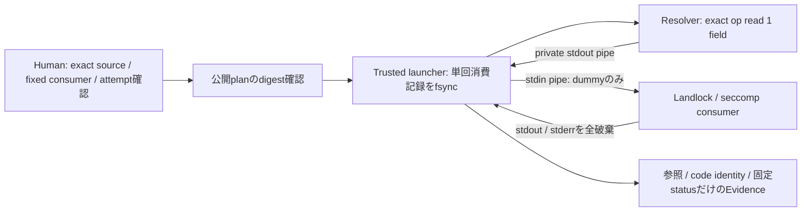

# Secret Handoff offline prototype（2026-09-18）

基準commit: `c859b0812eac307dc8cc35a4845871daf543c3dc`。このcheckpointを含むlocal commitが変更単位。
Humanは1Passwordを共通Secret Store候補として採用した。今回、実Secret・vault内容・Providerには接続していない。

## 結果と停止位置

**memory内dummy → 模擬op process → trusted launcher → 隔離consumer** は成立した。
初回対象CCWでは、環境値をEvidenceへ入れる既存問題を修正し、承認からHuman Previewまで非記録を確認した。
handoff先は固定の非LLM consumerであり、Claudeへのcredential接続ではない。
実`op`経由の成立性は未確認。PATH上の`op`/`op.exe`は存在せず、確認したWindows標準候補も存在しなかった。
Humanから「未導入・不明：offline検証を進める」と回答を得たため、installやvault探索は行っていない。
versionも未確認。模擬CLI成功を1Password実連携成功とは扱わない。

## Architecture



- `secret_handoff.py`: LLM・Broker非依存。公開source記述、確認digest、単回消費、取得、pipe受渡しを担当。
- `OnePasswordSource`: native Linux ELFの絶対pathとSHA-256、account、dummy専用の正確な参照を固定。
  実行する取得commandは`op read REFERENCE --account ACCOUNT --no-newline`だけ。
  `list`/検索、`signin`、`run`、`inject`、item mutation、Service Account、credential fallbackは実装しない。
- resolver環境は専用HOMEと`OP_BIOMETRIC_UNLOCK_ENABLED=true`のみ。親の`OP_*` token、proxy、PATH等は継承しない。
  resolver HOMEが空でない場合も起動前に拒否し、既存の手動login cache/configを拾わない。
  実desktop integrationがこの最小環境で動くかは未確認。失敗時に通常HOMEへ変更して再試行しない。
- `secret_consumer.py`: 制限適用後にstdinを読み、process内の`CCW_DUMMY_SECRET`一つだけへ設定する。
  source/account/reference/CLI実行pathは渡さない。network、exec/fork、外側file read、file writeを拒否。
  CPU/memory/core制限とparent-death signalを持つ。stdio以外のFDは閉じる。
- `isolation.enter(stdin_pipe=True)`はこの固定consumerの明示opt-in。既存Worker/runnerは従来どおりstdinを閉じる。
- attempt directoryはHuman側の空0700 directory。確認したplanを`consumed.json`へ0600で排他的に作り、
  file/directoryをfsyncしてから取得する。成功・失敗・中断で再利用不可。自動retry・別credentialはない。
  この単回記録はdummy専用。CCWの実Task承認、期限、ledger、permitの代用品にはしない。

## Secretを見られる範囲と保存規則

| Process / 場所 | Secret本体 |
| --- | --- |
| 1Password本体とtrusted op resolver | 実連携時は指定fieldを扱う。今回未実行 |
| trusted launcher | 取得stdoutと受渡しbufferとして一時的に保持 |
| 隔離consumer | 指定dummy一つのみ、memoryとprocess-local environment |
| Worker / LLM / Claude / Human Preview | 今回のhandoff値は渡らない |
| Repository / plan / checkpoint / Evidence / result | 値も値のdigestも記録しない。参照情報とcode digestは記録 |

dummyはharnessが毎回乱数からmemory内で作り、模擬opへもstdin pipeで渡す。argv、設定、fixture fileには書かない。
模擬opのstdin利用はTest専用。実`op read`のstdinは空で、Secretはstdoutから取得する。
戻り値は`ccw-dummy-` prefixと限定ASCII・長さを検査し、空値/改行/不正形式を拒否する。
これは実Secretを読んだ後に安全化する機能ではない。取得前のHumanによるdummy item特定が必須。

consumerがSecretやBase64表現を出力しても、両streamをboundedに読み捨てる。
値の置換・maskに依存しない。保存可能なTask結果を返す汎用channelはまだ設けていない。
例外本文も固定文字列に置換する。timeout/出力量超過は直接childをkill/reapし、再取得しない。
Evidenceの成功は固定consumerの終了statusであり、Provider認証や推論成功を意味しない。

CCWの`claude.environment_policy()`と`claude_real.environment_policy()`は、秘密値builderを呼ばず
固定の変数名・取得元・非継承方針を返す。contract/login plan/broker Evidenceはこの公開記述を使う。
実行時環境builderは引き続きprivateな実装。固定DNS設定等の公開定数は従来どおり契約に残す。
変更したcode manifestにより旧承認の流用は拒否される。旧Evidenceを新形式に書き換えない。

## 検証

| 検証 | 結果 |
| --- | --- |
| `python3 -B src/ccw/isolation.py` | Landlock ABI 3 |
| `python3 -B -m unittest discover -s tests -v` | 88 tests PASS（既存80＋追加8） |
| `python3 -B tests/smoke.py` | PASS、`.local/smoke-2waku62a/summary.json` |
| `python3 -B tests/b1_smoke.py` | PASS、`.local/b1-smoke-qi_4qbp2/summary.json` |
| `python3 -B tests/secret_handoff_probe.py` | PASS、`.local/secret-handoff-tco1m_1g/summary.json`（docs追加後の再走査） |

追加検証: 確認digest不一致時の取得前拒否、single-use、隔離不可時の取得前拒否、取得エラー・空値・
形式不正・過大出力・timeout、consumer失敗時の停止、正確なop argvと最小env、参照query拒否、binary hash変更拒否。
consumer内でsocket/exec/外側read/writeの実拒否を測定。両streamへの意図的なSecret出力を破棄。
CCWの環境builderにcanaryを注入する回帰は、public側がbuilderを一度も呼ばないことも検査する。
承認、DB、Evidence、Worker export、Human Previewを走査し、値がないことを確認する。
probeはscratch全file、Git diff、src/tests/docs（checkpointを含む）をcanaryの原文/Base64/hexで走査する。
不一致時にも値をtest failureへ出さない。実Secretや任意変換の網羅的DLP検証ではない。

初回追加テストは8件中1件ERROR。模擬CLIの`-I`起動で補助moduleのimport pathが欠けた。
1回修正して8件PASS、その後全88件PASS。失敗時も取得後のTask実行へ進まず、消費記録は保持。
resolver HOMEの汚染拒否を追加した最終Codeでも、全88件PASS（20.656秒）。初回probeのEvidenceは
`.local/secret-handoff-_vg5jd2g/summary.json`に保持。
docs更新時のpatchはcontext不一致で未適用になり、正しいcontextで1回再適用した。

## Windows / WSL

実測環境はWSL2 `6.6.87.2-microsoft-standard-WSL2`、Linux x86-64、Landlock ABI 3。
Linux process間のpipe、最小環境、隔離consumer、終了処理を実測した。scratchはLinux filesystem上の`.local/`。
Windows側のPowerShell/WSL executableの存在は確認したが、起動・設定変更は行っていない。

| 方式 | 今回の判断 |
| --- | --- |
| WSL native op → WSL trusted launcher → Linux pipe consumer | adapterを実装。op本体・desktop接続・dummy readは未検証 |
| Windows op.exe → WSL内からinterop → consumer | 未実装・未検証。native ELF限定adapterはop.exeを拒否 |
| Windows trusted launcher →明示的WSL processのstdin | 将来候補。pipe bytes/CRLF/encoding、Windows env継承、終了回収、interop権限を別途検証 |
| Windows native consumer | Linux Landlock/seccompがないため本prototypeは停止。無隔離fallbackなし |

Windows desktop appがあるだけで、WSLのLinux opと連携可能とは扱わない。
`WSLENV`でSecretを共有したり、一般shellへexportする仕組みは追加しない。
Windows opを動かす場合もtrusted側だけに閉じ、runtimeへWSL interopやvault権限を与えない。

## 実op / Human作成dummy itemの次手順（今回はここで停止）

> 2026-09-19: Independent Reviewを受けて手順3〜5と起動条件を更新した。
> [修正checkpoint](checkpoint-secret-handoff-fixes-20260919.md)のrunbookを優先する。

1. HumanがCLIの導入場所とversionを特定する。install、desktop連携設定変更が必要なら別途承認する。
   確認する非Secret commandはそのbinaryの`--version`と`read --help`のみ。account/vault/item一覧は使わない。
2. Humanが別途作成を許可したdummy専用vault/item/fieldを明示する。今回item作成の許可はなく、実施していない。
   adapterの参照形式は`op://ccw-dummy-NAME/ccw-dummy-NAME/ccw-dummy-secret`。
   専用item名は一意にし、既存Secretを同名で指定しない。Humanが新規dummyだと確認する。
   値は`ccw-dummy-`に16〜128文字の英数字/underscore/hyphenを付けた無権限の文字列。
   値をAgent、chat、shell argv、履歴、記録terminalへ貼り付けない。
3. Linux filesystem内に専用0700 resolver HOMEと空0700 attempt directoryを用意する。
   credential/cacheを通常HOMEからcopyしない。app連携に追加環境やCapabilityが必要なら停止して再reviewする。
4. trusted Human processから下記APIでpublic planを表示して確認し、そのdigestだけを渡す。
   これは手順例であり、Agentから実readを自動実行するcommandではない。

```python
from pathlib import Path
from ccw.secret_handoff import OnePasswordSource, plan, digest, run_dummy

# 以下はHumanが確認した非Secret情報だけ。SECRET_VALUE引数は存在しない。
source = OnePasswordSource(OP_ABSOLUTE_PATH, OP_SHA256, ACCOUNT,
                           DUMMY_REFERENCE, RESOLVER_HOME)
attempt = Path(EMPTY_PRIVATE_ATTEMPT)
public = plan(source, attempt)   # opを起動しない
print(public, digest(public))   # Humanがsource/consumer/attemptを確認する
# 別の明示操作で、Humanが確認したdigestを渡す。自動確認に配線しない。
result = run_dummy(source, attempt, HUMAN_CONFIRMED_DIGEST)
```

5. stdoutには`result`の固定status/metadataだけを扱う。opの生出力をterminalへ流さない。
   失敗時はconsumed/failureを残して停止し、別account/login/tokenへfallbackしない。
   timeout後はop/helperの終了をHumanが確認する。新attempt作成で自動再試行しない。

`read`と`--no-newline`は[1Password公式command reference](https://www.1password.dev/cli/reference/commands/read)に基づく。
account明示とdesktop連携は[公式app integration](https://www.1password.dev/cli/app-integration)を参照した。
これらは公開仕様の確認であり、ローカルCLI実測ではない。docsにあるvault listや設定変更は実行していない。

## setup-token前のHuman Gate / 残Risk

- 最初に実CLIで**無権限dummyだけ**の取得・受渡しを検証する。今回の模擬結果を代用しない。
- このAPIはdummy専用。実credential受理、Claude環境名へのmapping、実Taskのpermitとの結合は別review。
  source・対象process/code・Task・期限のbind、取得前の単回消費、失敗後の再取得禁止をCCW側へ接続する必要がある。
- 実CLI/LLMは出力やログへcredentialを複製し得る。既存Claudeのraw stdout保存は今回変更していない。
  「環境値のEvidence混入修正」はraw/logが安全という保証ではない。実Secret注入前に結果channelを設計し直す。
  全出力破棄の現在consumerだけが、変換出力も記録しない小さい境界を持つ。
- trusted launcher/resolverはSecretを見る。Python bytesの確実なzeroization、OS swap、trusted側crash dump、
  未隔離の同UID/root/Windows管理者からの秘密保護は保証しない。consumerだけcore dumpを無効にしている。
- binaryをhash検証してからpath実行するためtrusted側の同時差替えTOCTOUは残る。sealed main ELF保証ではない。
  op内部cache/log/子helper/内部通信/内部retryの抑止は未検証。launcherの直接起動回数1と混同しない。
- source名とaccountは非Secret metadataとして記録されるが、組織情報として非公開にする場合がある。
  OS crash後の完全なストレージ耐久性やHumanによるledger削除への対抗機構ではない。
- setup-tokenの発行、scope/期限、保管、個別失効、課金/追加使用、Provider通信、初回推論は別Human承認が必要。
  専用`/login`設計は維持。既存Real Gate・single-use permit・no-retry・network制限を緩めていない。

## 非LLMへの再利用 / rollback

共通部は`public()`（参照のみ）と`resolve()`（private bytes）のsource interface、公開plan確認、
単回記録、bounded pipe、出力破棄で構成する。Claude/Broker/モデル名への依存はない。
小さい非LLMツールには、固定consumerをそのツール用のレビュー済みprocessへ置き換え、必要な1値だけを渡す。
任意command実行APIやdaemonに広げず、必要なfile/network権限と返却結果channelを個別reviewする。
Worker/AgentのTool一覧へ`resolve`やop CLIを登録しない。Secret Store選択・検索をTaskに委譲しない。

rollbackは本checkpointを含むcommitをlocalでrevertする。基準commitへのhard resetは使わない。
`.local/`のEvidence、CCW ledger、消費済みpermit、dedicated auth homeを巻き戻さない。
旧Evidenceの照合が必要なら当時のcommit/runtimeを別checkoutで保持する。
本変更を戻すと環境値のEvidence混入経路も戻るため、実Secret投入は禁止のままにする。
