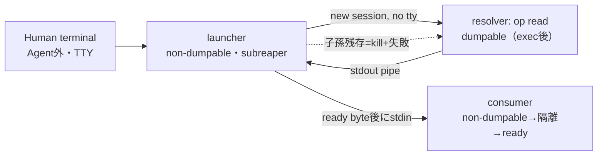

# Secret Handoff: Independent Review修正（2026-09-19）

基準commit: `83d7e9de5a64ff3c83c94033e570a281794e567c`。このcheckpointを含むlocal commitが変更単位。
[前回checkpoint](checkpoint-secret-handoff-20260918.md)のrunbook手順3〜5は本書の手順で置き換える。
今回も実Secret・実1Password item・`op`/`op.exe`・setup-token・Providerは使っていない。
PATH上の`op`/`op.exe`は存在しない（存在確認のみ）。

## 修正したFinding

| Finding | 修正 | 状態 |
| --- | --- | --- |
| P1-1 祖先processからlauncher/consumer memoryを読める | launcherは取得前に、consumerは入力前に`PR_SET_DUMPABLE=0`。consumerは隔離後にready byteを送り、launcherはそれまで値を書かない | Closed（launcher/consumer）。resolver子processはPartial |
| P1-1 Agentの子孫から起動し得る | `run_dummy`に`launch_guard()`：stdin/stdoutがTTY、`CLAUDE*`/`CODEX*`/`AI_AGENT*`環境変数なし、祖先に`claude`/`codex`なし。runbookにTrust Boundaryを明記 | Partial（誤起動防止。悪意ある同UID processへの防御ではない） |
| P1-2 子孫processが残る | `exchange()`は実行中だけchild subreaper、子は新session（制御端末なし）。子の終了後に残る子孫をkill・reapし、成功でも**失敗扱い** | Closed（Linux process）。実opの挙動はOpen |
| P1-2 cache/background | 固定argvへ`--cache=false`。公開planに`cli_flags_verified_on_local_binary: false` | Partial（実binary未確認。未対応flagならfail-closed） |
| P1-3 認証経路 | コード変更なし。Human Gateとして下記に整理 | Open |
| P2-2 sourceの差替え | `run_dummy`は`type(source) is OnePasswordSource`のみ。subclassは`public()`でも拒否。fake用は別entry `run_offline_fixture`で、`OnePasswordSource`を拒否。`real_op_read`はentry由来で自己申告ではない | Closed |
| P3 Ctrl-C時のEvidence | `BaseException`でも`failure.json`を残して停止 | Closed |

範囲外として触れていないもの：P2-1（digestは認可tokenではない）、P2-3（既存Claude raw保存）、
P3（environment policyのkey一致test、stdlib identity、binary hash後のTOCTOU）。
どれも実Secret/LLM注入前の課題で、今回のdummy試験の成否には直接関わらない。

## Process boundary（修正後）

### Secretが見えるprocess範囲

| Process | 値 | 同UID祖先からの読取り |
| --- | --- | --- |
| 1Password本体 | 実連携時のみ | 1Password側の保護に依存（未確認） |
| resolver（`op`、今回はfake op） | stdoutへ書くまで | **可能**。exec後にdumpableへ戻るため。probeで`found`を記録 |
| launcher | 取得後〜consumer終了 | 拒否（`/proc/PID/mem`、`/proc/PID/fd`ともに`denied`） |
| consumer | ready後〜終了 | 拒否（同上） |
| Worker / LLM / Agent / Preview / DB / Evidence / Git | なし | — |

resolver子processを守れないため、「launcherがAgentの子孫でない」ことが実質的な境界になる。
非子孫の同UID processは`ptrace_scope=1`（本環境で確認）により、元々resolverを読めない。
ただし同UIDのAgentが自分で`op`を起動する経路はCodeでは閉じられず、1Passwordの認可promptだけがgateになる。

### process終了後に残り得るもの

- **消える：** launcherの子孫であるLinux process。成功・失敗・timeout・Ctrl-Cのどれでもkill・reapする。
  子孫が一つでも残っていた場合、その実行は失敗として記録される。
- **残り得る（未確認）：**
  - 1Password desktop app本体と、その認可session（有効時間内なら他の同UID processも使える可能性）。
  - `op`がIPCで起動するdesktop側helperなど、launcherの子孫ではないprocess。
  - resolver HOMEに`op`が書くconfig等。内容は未確認のため、Humanが確認して削除する。
  - launcher/consumerのfree済みmemory。zeroizationは保証しない。swapへの退避も防がない。
  - attempt directoryの`consumed.json` / `result.json` / `failure.json`。値は含まない。

## Verification

| 検証 | 結果 |
| --- | --- |
| `python3 -B src/ccw/isolation.py` | Landlock ABI 3 |
| `python3 -B -m unittest discover -s tests` | 93 tests OK（既存88＋追加5） |
| `python3 -B tests/smoke.py` | PASS `.local/smoke-2fgxlnir` |
| `python3 -B tests/b1_smoke.py` | PASS `.local/b1-smoke-4wgowpet` |
| `python3 -B tests/secret_handoff_probe.py` | PASS `.local/secret-handoff-cbmdg5n1`（descendant modeを追加） |
| `python3 -B tests/secret_boundary_probe.py` | PASS `.local/secret-boundary-td2rs_99` |

`secret_boundary_probe.py`の構成：
- probe process自身が同UIDの祖先として、実際のlauncherとconsumerのmemoryを読みに行く。
- 同じ読取り方法で、通常のdumpable processからは値を`found`できる（control）。
  したがって`denied`は手法の失敗ではない。
- 子孫processのケース：
  - 「inherit」（stdoutを継承したまま残る）と「daemon」（setsid＋二重fork、stdioを切る）の2種。
  - どちらも失敗扱いになり、実行後に子孫は存在しなかった。
- 同じdescendantケースを基準commitのcodeでscratch実行した結果：
  - daemonは**成功扱いのまま子孫が生存**、inheritはtimeout後も子孫が生存。
  - 修正前の問題を再現し、修正後に消えることを確認した。
- memory読取りのbaselineは、Independent Reviewのscratch probeで再現済み（consumerから`found`）。

追加したunit test：
- `run_dummy`はfake sourceとOnePasswordSourceのsubclassを拒否し、fake用entryはOnePasswordSourceを拒否する。
  どちらもresolver呼出しは0回、attemptは未消費。
- 非TTY、Agent環境変数、Agent祖先のそれぞれで`run_dummy`を拒否し、exchangeは未呼出し、attemptは未消費。
  guardはattempt消費より前に評価する。Agent外のterminalから同じattemptでやり直せる。
- `run_dummy`のend-to-end：op processだけstubに置き換え、実consumerで成功させる。
  `real_op_read: true`、値の非記録、同一attemptの再利用拒否、launcherのnon-dumpableを確認。
- exchange：子孫が残るとfail。clean exitでも残存子孫があればfail。終了後にsubreaper設定を元に戻す。
- consumer：ready byte前は値を受け取らない。ready後はmemoryを読めない。

既存testも引き続きPASSした。対象は次のとおり。
- 取得失敗・空値・不正値・過大出力・timeoutで停止し、fallbackもretryもしないこと。
- 取得前にpermitを消費すること。
- 承認・DB・Evidence・export・Human Preview・Git diffに値が残らないこと。
- Real Claude Gateが無効のままであること。

## Human起動runbook（実`op` + Human作成dummy）

**Trust Boundary：** launcherは、Humanが自分で開いたterminalから起動する。Agentの子孫であってはならない。
- NG：Claude Codeの`!`、Agentのshell、Agentが開いたterminal、Agentが操作しているtmux/screen。
- 起動元がAgentの子孫だと、resolver（`op`）のmemoryとpipeをAgentが読める。
- `launch_guard()`はこれらを誤起動として拒否する。拒否されてもguardをpatchせず、terminalを変えて最初からやり直す。

1. Agentのsessionとは別に、WSLの新しいterminalを開く。
   `env -i HOME="$HOME" PATH=/usr/bin:/bin TERM="$TERM" bash --noprofile --norc`で最小環境にする。
   `CLAUDE*`/`CODEX*`/`AI_AGENT*`が残っていると拒否される。
2. 認証経路とCLIをHumanが決める（下記Gate）。このadapterはnative Linux ELFの`op`専用。
   `--version`、`read --help`、global flagsのhelpで次を確認する。確認は非Secret commandのみ。
   - `--cache`が`--cache=false`の形で受け付けられるか。
   - `--no-newline`と`--account`があるか。
   受け付けないflagがあれば停止する。flagを外した版を作らずに、再reviewへ戻す。
3. Humanが別途作成を許可したdummy専用item（`op://ccw-dummy-*/ccw-dummy-*/ccw-dummy-secret`）を明示する。
   値は`ccw-dummy-`＋16〜128文字の無権限文字列とする。Agent、chat、argv、履歴には出さない。
4. Linux filesystem上に、空の0700 resolver HOMEと空の0700 attempt directoryを新しく作る。
5. 手順1のterminalで`plan()`を表示し、source/argv/process/consumer/attemptを確認する。
   確認したdigestを`run_dummy`へ渡す（API例は前回checkpointを参照）。
   1Passwordの認可promptは、この操作による1回だけを承認する。予期しないpromptはすべて拒否する。
6. 終了後に次を確認する。
   - `result.json` / `failure.json`の固定status。
   - `pgrep -a op`で`op`関連processが残っていないこと。desktop app本体は別扱い。
   - resolver HOMEのfile名一覧。確認後に削除する。
   失敗・timeout・Ctrl-Cのどの場合も、新しいattemptで自動再試行しない。通常HOME、signin、tokenへfallbackしない。

## 実`op.exe` dummy試験へ進むために残る事項

本adapterはWindows版`op.exe`を拒否する。`op.exe`経路には、別のresolver bridgeの設計とreviewが必要。
- WSL interop経由で起動したWindows processには、Linuxのsubreaper/kill/reapが届くとは限らない。
  process lifetimeの保証をWindows側で作り直す必要がある（Job Object等、未設計）。
- Windows側の同一user processがop.exeのmemoryを読める可能性がある。`PR_SET_DUMPABLE`はWindows processに効かない。
- stdoutの改行・encoding（CRLF）の扱い。`WSLENV`によるenv受渡しは使わない。
- desktop app integrationの認可単位（process単位かterminal単位か）と有効時間。
- `--cache`等のflagと、Windows版のcache/daemon挙動。
- op.exeの取得とconsumerへの受渡しがWSL境界をどう越えるか。どこでpipeを終端するか。

native Linux `op`経路でも、次は未確認のまま：
- desktop appとの連携が、空HOMEと最小envで成立するか。
- `--cache=false`が受け付けられ、実際にbackground processが残らないか。
- op内部のログ・retry・通信。
- 認可promptの単位。

## 次のHuman Gate

1. 本commitの修正をreviewする。
2. 認証経路を選ぶ。どれも別のreviewが必要。
   - WSL内のLinux版1Password app＋native `op`：本adapterのまま試せる。
   - Windows `op.exe` bridge：新規設計。
   - dummy専用vaultに限定したService Account：新Capabilityになるため、明示承認が必要。
3. 選んだCLIの導入とversion確認、flagの受理確認。installや設定変更は別承認。
4. dummy専用vault/item/fieldの作成を承認する。
5. 上記runbookに従い、Humanが1回だけ実行する。

setup-token、実credential、Claudeへの注入は、これらが終わった後の別Gate。

## Rollback

本commitをlocalで`git revert`する。基準commitへのhard resetは使わない。
revertすると、祖先processからのmemory読取りと子孫processの残存が再び成立する。
そのため、revert後は実`op`試験に進まない。`.local/`のEvidence、consumed attempt、resolver HOMEは巻き戻さない。
