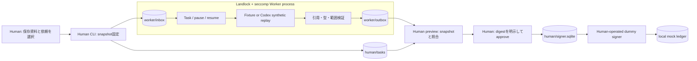
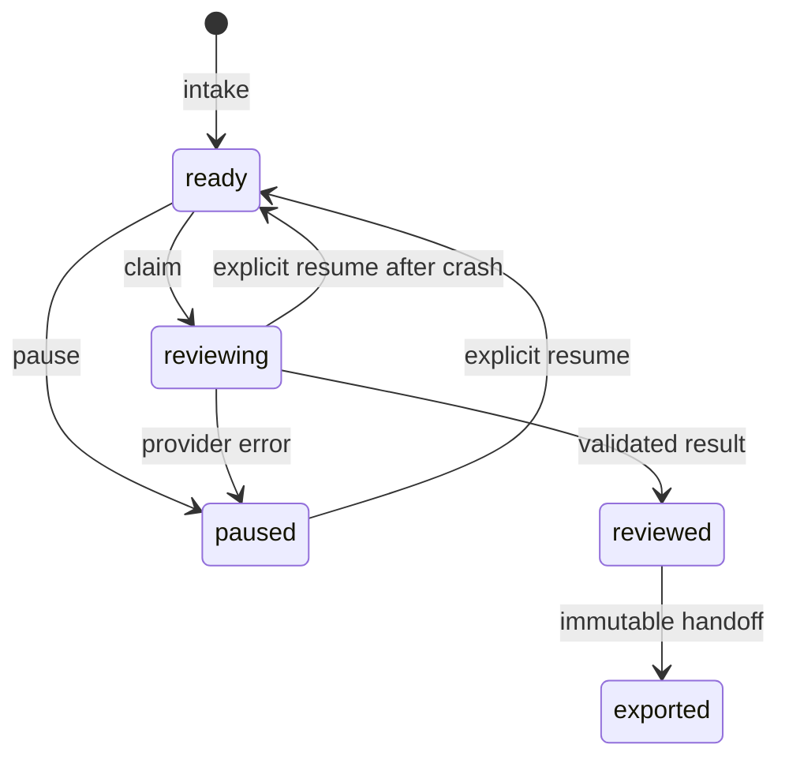
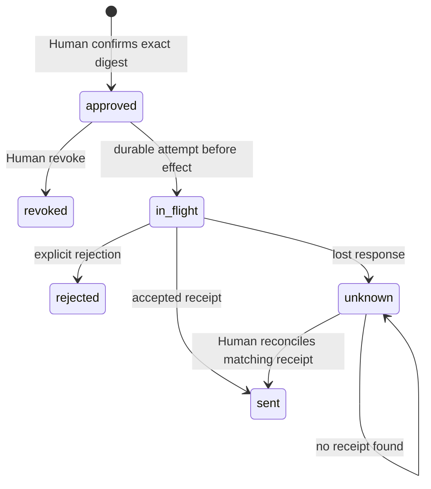
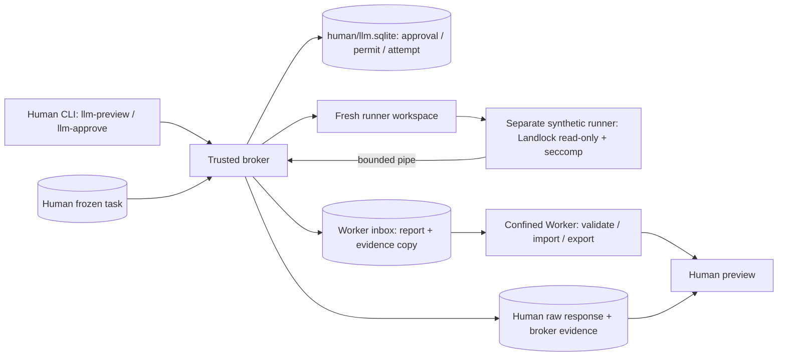
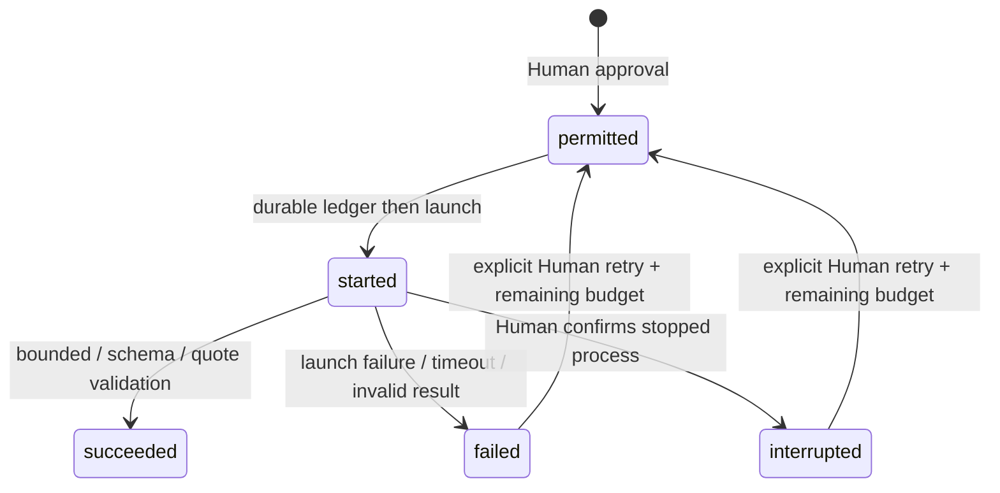
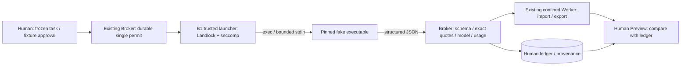

# v0.1 / Batch B0〜B3 設計

Messages APIの現行条件付きrelease candidateは
[2026-09-21 checkpoint](messages-api-release-candidate-20260921.md)を参照。
既存FLOP資料1件とfixed promptのrequest／payload identityに限定する。
Real permit v2はpolicy全体、Human attestation、実行network namespaceへ結び付き、
policy内のHuman条件はコードによるConsole検証ではない。旧v1はOffline candidate専用。
最終Independent ReviewとHumanの最終許可が未了であり、この変更はReal GOではない。
permit → release → consumed → credential → runtime、transport直前expiry、
single-use transportとOutput Boundaryは維持する。

現行判断は末尾と[B3 checkpoint](checkpoint-b3-20260918.md)を参照。B0〜B2節は設計経緯を含む。
B0節の実Codex専用UID必須という記述は当時の判断で、B0再レビュー後は必要性未確定に変更した。

Secret Handoff prototypeは[専用checkpoint](checkpoint-secret-handoff-20260918.md)を参照。
Human側だけが1Passwordの明示参照を解決し、固定の非LLM consumerへdummyを匿名socketで渡す。
CCWの公開environment policyは環境値builderから独立し、変数名とcredential sourceだけを記録する。
Real/専用loginのGateは維持し、実ClaudeへのSecret注入は未接続。既存raw response保存経路へ
Secretを渡してよいという保証ではない。新consumerの出力は両streamとも保存しない。
Review修正は[修正checkpoint](checkpoint-secret-handoff-fixes-20260919.md)：launcher/consumerのnon-dumpable化、
子孫processのkill・reapと失敗扱い、実op entryのsource固定、Agent外terminalからの起動条件。
最新の[A/B/C checkpoint](checkpoint-secret-abc-20260919.md)ではresolver stdout/stderrを匿名socketへ変更し、
同UIDの`/proc/PID/fd` pipe再open経路を閉じた。[consumer window checkpoint](checkpoint-secret-consumer-window-20260919.md)で
consumer stdin/stdout/stderrも匿名socketへ変更し、non-dumpable化前の再openによるready偽装・入力読取りを閉じた。
exchange実行中のHUP/INT/QUIT/TERMだけを停止要求としてcleanup後に失敗させる。SIGKILL/native crash、
他の既定終了signal、およびexchange外（子processなし）での終了はfailure記録なしの残Risk。
actual environmentと公開key集合の一致、および追加・削除driftの検出はoffline testで検証する。

## Claude Runtime Service v1 (Offline)

詳細は[Runtime Service checkpoint](checkpoint-runtime-service-20260919.md)。
Activityはcredential非依存の`runtime_interface.RuntimeClient`と接続済みsocketのみを持つ。
独立した`runtime_service.py`が事前固定Task digest、単回実行、サイズ／時間／並行数を強制し、
既存Secret Handoffの匿名socket transportで隔離済み`runtime_fixture.py`へdummyだけを渡す。
結果は既存Fixtureと完全一致する場合だけ公開し、raw出力・credential・env値を保存しない。
Worker本体・Human brokerの既存credential／permission境界は変更しない。
Supervisorとroot管理者は信頼対象。別UID・Production権限・実Claude出力の公開条件は未実装。

## Trust boundary

`worker.py` が信頼されたbootstrapとして引数・roleパス・resource limitを設定し、
Landlockとseccompを自身に適用してからinputを読みます。Worker内のfixture/replay providerも同じ制限下で動きます。
Worker中のPythonライブラリ関数へアクセスされても、HumanのDB/鍵/認証ファイルを開くsyscallが拒否されます。
Workerから別のPythonやHuman CLIを実行する経路もありません。

LandlockはABI 3の全filesystem accessをhandledとし、worker subtreeには通常データのread/write/create/removeを許可、
execute、device、socket、FIFO、symlink作成を許可しません。seccompはx86-64の必要なsyscallだけを許可し、
別ABIはkill、未許可syscallはEPERMにします。新しいABIの操作はseccompで拒否される構成です。
OSを変更せず、process自身の権限を下げるだけです。プロセス外のOSユーザーを認証する機構ではありません。

無害なテストファイルによる敵対的probeで鍵/承認/認証のread、承認write、外部symlink/hardlink、
継承FD、socket、exec、fork、ptrace、process_vmを検査します。Sandbox不在はskipせず失敗にします。
カーネル脆弱性、root、信頼されたPython/bootstrapの改変、Human CLIの誤公開は脅威モデル外です。

## 固定と検証

bundleのrequest、scope、destination、source本文・locator・digestからcanonical JSON SHA-256を計算します。
キー順やJSONの空白は同一Taskですが、source順序・依頼内の空白は意味を持つ入力としてそのまま固定します。
資料を自動正規化して別の依頼とまとめません。

Humanは自分のsnapshotをWorkerとは別の領域に保存します。Workerによる固定bundleの改変はTask hash再計算で検出し、
handoffで別Taskへすり替えてもHuman snapshot照合で拒否します。
Worker状態DBはWorkerから変更可能であり、承認の信頼根にはしません。

reviewのfindingにはseverity、observation、evidence、suggestionが必須です。
evidenceはsource ID / SHA-256 / start_line / end_line / quote。範囲内の全文行との一致を検証します。
unverifiedは1件以上必須で、Fixtureの限界も明記します。正しい引用は正しい推論の証明ではありません。

外部資料やURLはJSON文字列であり、shell / import / templateとして評価しません。
入力はサイズ上限を持つ単一リンクの通常ファイルのみ、symlinkやFIFO等は拒否します。
JSONの重複キー、NaN、未知field、壊れた引用を拒否します。成果物はfsyncした一時ファイルから排他的に公開します。
DBはSQLite synchronous=FULL、同一roleでのCLI同時操作はflockで拒否します。
HumanとWorkerはそれぞれ別DB/lockを使い、handoffを信頼境界として扱います。

## 状態と送信の停止

中断したin_flightも再送不可です。SQLite commit直後・transport直前で中断しても同じ扱いです。
TTLは新規送信開始時のみ検証し、すでに結果不明となった操作の照合は期限後も可能です。
reconcileは模擬受領側ledgerを読み、一致するpayload digestとダミー署名を検証します。
負の照合結果から再送へ戻す遷移はありません。承認はTaskごとに一度だけです。

署名は公開ダミー鍵によるHMAC-SHA256です。目的はbytes bindingと処理順のテストのみです。
Technocoreの署名、identity、nonce、wire formatを再現したものではありません。
実Transport自体が存在せず、method/URLを任意指定するAPIもありません。

## Codex経路の制限

CodexCLIAdapterはlegacy合成Replayの戻り値を検証します。実行可能なCodex argvをWorker内で生成しません。
新しいHuman brokerの`contract()`がmodel必須の候補argv・prompt・固定JSON Schema・設定overrideを生成します。
実行経路は固定のPython合成runnerだけです。`provider=openai`は承認があってもattempt開始前に拒否します。

## Batch B0: runner / approval / provenance

信頼根はHuman側DBとtrusted bootstrapです。Worker/runnerは承認DB、Signer state、通常homeや
他Repositoryを読めず、brokerのprocess memory・FD・resource limit・signalへアクセスできません。
HumanのLLM CLIはWorker Toolではなく、runnerはbroker APIや任意commandを受け取りません。
未隔離同一UIDからの直接DB編集・root・trusted codeの改変は依然として脅威モデル外です。

brokerはHuman snapshotから新規`runner/ATTEMPT_ID/`へinput/request/schema/policyの4ファイルと
空の`home/`・`codex-home/`を作成します。任意の作業cwd、既存workspace、caller指定実行ファイルは受け付けません。
Pythonは`-I -B`、環境空、FD非継承、stdinはnullで起動します。trusted import完了後、資料を読む前に
runner自身へLandlockとseccompを適用します。新規cwd subtreeだけreadを許し、全write/exec/networkは禁止です。
HOME/CODEX_HOMEを専用空領域へ設定し直します。認証・keyring・外部configの探索はありません。
workspaceの余分なentryやhome内のconfig/hooks/plugin混入は拒否します。
runnerの親終了時kill、CPU/メモリ上限、brokerによるwall timeout、stdout/stderr合計bytes制限を備えます。
Landlockのpath metadata非秘匿性は変わりません。errno=ENOENTをread拒否成功とは数えません。

attempt開始は`BEGIN IMMEDIATE`内でunused permitをconditional UPDATEし、attempt/予算予約/eventを
SQLite synchronous=FULLでcommitしてからworkspace作成・child起動へ進みます。Human lockはchild終了まで保持します。
初回承認はtaskごと1回、初回permitは1個。attempt上限は1〜5、timeoutは1〜120秒、TTLは1〜3600秒。
requestはcanonical契約全体のbytes、response制限はraw stdout+stderr合計、累積requestは失敗時も消費します。
将来の費用上限は条件として保持しますが、実送信の課金・内部retryを抑止する実装はまだありません。
syntheticは通信0・課金0であり、実利用の費用上限を検証したとは扱いません。

各retryは新attempt IDで、直前attempt IDと同一approval digestを明示します。permit発行と実行は別操作です。
中断して`started`が残れば自動回復せず、全予約budgetを保持します。成功後のretryは不可です。
保存済み結果の再exportだけはprovider起動なしで可能です。既存artifactが変わっていれば上書きせず停止します。

broker Evidenceはprovider/model/CLI version/task・request・raw response・report・schema digest/attempt ID/
approval digest/runnerコードdigest/実際のargv・cwdを記録します。CLI versionは合成runtimeの
`ccw-synthetic-1`、real_cli_versionはnullです。実Codex versionを捏造しません。
Workerへのコピーのdigestは署名ではありません。Human `llm-verify`と通常previewは隔離されたHuman DBと
全体比較し、WorkerがEvidenceを改変してhashを再計算しても、削除しても拒否します。
legacy fixture/replayにはbroker Evidenceがなく、provider文字列だけで実LLM由来と認めることはありません。

## Real LLM Gateの判断

本環境では同一UIDの**合成runner**のOS隔離を確認しました。ただしexec/socketを許す必要がある
実Codex launcherは未実装です。合成runnerでの成功を、Codex本体・認証・hosted toolsを含む隔離証明に流用しません。
live経路は停止しています。専用OS UIDが必須かどうかは未確定で、UIDだけで通信/interopは解決しません。
sudo/UID作成やホスト設定変更は行いません。

候補argvでは`codex exec`、`--model`、`--cd .`、`--output-schema schema.json`、`--ignore-user-config`、
`--ignore-rules`、`--ephemeral`を指定し、`-c default_permissions="b0"`と最小read profileを使います。
旧`--sandbox`はprofileと混在させません。shell/unified_exec、web search、MCP、plugins、hooks、apps等は
設定契約で無効にしますが、実binaryの設定解釈・managed configとのmerge・有効Tool一覧は未検証です。
profileの`:minimal`例外を外側のSecret隔離の代用にはしません。
command用network policyはhosted web search/MCP/Browser/plugin経路の制御ではありません。
一切のsocket/execを拒否する現在の外側境界と、将来Codex用の設定候補を区別します。

次のReviewでは専用UID、brokerとの通信・credential境界、実binary/version固定、effective configとTool一覧、
endpoint制限、課金/時間/内部retry上限、providerが実際に返したmodel/version等のEvidenceを確認します。
モデル名の文字列固定だけではbackend revisionの不変性を保証しません。

## 実装範囲外

HumanのOSログイン証明、異なるUID/VMへの展開、Windows/macOS/他CPU対応、実LLMと実Technocore互換、
大規模資料の分割、semantic duplicate検出、複数Worker並列処理、監査ログの外部署名、DB migrationは未実装です。
実送信前には専用TransportとSignerを実装し、受領証照合とexact bytesの意味を公式仕様で確認する必要があります。

## Batch B1: exec可能なClaude launcher

Human Brokerの同じapproval/permit/attempt tableを使う。承認format 2はledger instance UUID・root・
最初のpreviewを起点にしたTTL/絶対期限・request digestをbindする。DB再作成時は別instanceとなり、
古い承認digestでは承認できない。DB全体の巻戻しや意図的編集を防ぐ復旧基盤ではない。
旧approvalは照合用として保持し、起動・retryを拒否する。B0のfailed/interrupted挙動は合成専用として維持する。

launcherは入力を読まずに制限を適用し、絶対path/digestを固定したexecutableをexecする。
B1のhash検査後のpath execにはTOCTOUの余地がある。B2の同一object保証と混同しない。
FakeはPython interpreter + 独立script。両方のdigestを固定し`-I -S -B`でsite処理も抑止する。
実binary用version/help probeも同じlauncherを使う。実推論の有効化switchはない。
モデル入力はrequest/scope/sourcesのみ。task/room/root/ledger/auth fixtureはstdinに含めない。
CLIが独自に付加する文脈の範囲は実推論未検証で、意図だけを送出範囲の証明にしない。

Landlockはworkspaceのread、専用home/claude-home/tmpの通常ファイルwrite、固定binaryのread/exec、
固定fixture scriptとOS library領域のreadだけを許可する。`/etc`の管理設定・通常HOME・他repo・Human DBは許可しない。
exec許可はB0/Workerの制限を変更せず、別launcher内だけで行う。
seccompはsocket/socketpair全拒否、fork/vfork拒否、cloneは同processのthreadに限る。
ただしB1のclone3はEPERMであり、glibcがcloneへfallbackしてthread生成できることは保証しない。
signalは自身のthread group宛てtgkillだけ。ptrace/process_vm/pidfd/io_uring/namespace変更等を拒否する。
UNIX socketやWSL interopもsocket生成段階で閉じる。これはoffline境界であり、通信許可時のegress制御ではない。
カーネル・OS library/bootstrap、未隔離Human操作者は信頼する。metadataの存在は隠さない。

親はstdinを非blockingで送出し、stdout/stderr合計bytes、wall timeout、停止markerを監視する。
childの出力EOF後も停止を監視する。通常停止はkill/reap、親強制終了はparent-death SIGKILLを使う。
attempt開始後のbudgetは返却しない。B1はlauncher起動1回・retryなし。CLI内部turn/request/retry回数は別概念。
`--max-turns 1`は要求値であってProvider request数1の強制を意味しない。

認証は公式CLIへ任せる設計だが、B1はcredentialを配置しない。
auth取得interfaceはtransport注入で合成statusを取得し、正規化fixture protocolの完全一致を検査する。
Brokerの承認には固定fixture判定をbindし、別のFake auth-status exec probeで取得経路を検査した。
runtime launcher起動中にauth subprocessを追加しない。実auth-status JSON fieldへのmapper、公式認証専用home、
refresh時のwriteとendpoint、通常HOMEを読まずに初回loginする手順は未実装/未確認のReal Gate。
OAuth確認だけでは追加credit無消費を証明できない。Realでは公式画面の追加使用OFFと請求経路の別確認が必要。

報告のSchemaは型・field・件数・長さを検査し、quoteはsource digest/行範囲/全文行一致で再検証する。
要求modelとmodelUsage keyが一致しない・欠測なら拒否する。CLI resultの余分なfieldはfixture profileで拒否する。
実版でのmetadata field一覧・modelUsage/usageの定義の互換性確認が必要で、自動で未知fieldを信用しない。
値の欠測はnull。reasoningの別値は不明でoutputへ二重加算しない。cache/入力/outputも合計を作らず保存する。
CLI session IDはProvider request IDではない。API相当推定額はサブスクの実請求ではない。
raw stdoutは成功/受信済み拒否の場合にHuman DBに保持する。途中stdoutとstderr本文は保持しない。
結果不明時のusageはnull。完全な応答がないことを消費ゼロと解釈しない。

request digestはcanonical契約全体、stdin digestは送出するascii bytes、response digestはraw stdout bytes、
report/schema digestはcanonical JSON、code_manifestは明示した7 module全体、binary/fixture digestは全file bytes。
OS loader/library・Python stdlib・kernelはdigest closure外の信頼基盤。実CLI依存物全部の証明ではない。
artifact全体のhashをWorkerが再計算してもHuman DBとの照合で拒否する。Providerの暗号学的証明ではない。
コード更新・binary更新後は旧契約との一致が失われ、照合も止まる。旧Evidence検証には元commit/runtimeを保持する。

## Batch B2: native / online用の別境界

B1 profileは変更しない。B2は`claude_real_launcher.py`で別のLandlock/seccomp profileを構成する。
Brokerのapproval/permit/ledger/stop/capture/validation/handoffを共有するが、RealはBrokerとlauncher入口で
無条件停止する。online mechanicsの存在やoffline承認をlive許可に転用しない。

native ELFをO_NOFOLLOWで一度openし、別memfdへcopy、write/grow/shrink/sealをkernelでsealする。
seal後のobjectからSHA-256を取り、承認hashと照合し、FD 3のAT_EMPTY_PATH execveatで同じobjectを起動する。
FDはCLOEXECで閉じる。起動後のmemfd_create、execve、fork/vfork、別FDでのexecveatを拒否する。
kernel、dynamic loader、library領域とtrusted bootstrapは信頼基盤に残る。
0500のdisk copy、version文字列、元のインストールpathだけでimmutable identityを主張しない。

syscallはmemory/filesystem/thread/event-loop/signal/networkの分類で管理する。
clone3にはENOSYSを返しglibc fallbackを可能にする。cloneは許可したpthread flagsの完全一致に限定する。
signalは同thread groupのtgkill、prlimitは自processだけ。ptrace/process_vm/pidfd/io_uring/namespace変更は禁止。
Landlockは専用workspace/home/tmp/authのみ通常write、OS libraryとTLS/DNSの指定fileのみread、
ELF interpreterだけexecuteを許す。native初期化に必要な`/proc/self/maps`は当該processのfileだけreadを許す。
通常HOME、他repo、Human/Signer/Broker DB、他processのproc内容、管理設定は許可しない。
Landlock ABI 3のmetadata可視性は残り、信頼された同UID Humanによる改変防御は範囲外。

online seccompはINET/INET6のTCP streamのみ。全FDは起動前に整理され、UNIX socket/socketpair/NETLINKや
FD受渡しによるuser D-Bus/WSL interop経路を開けない。endpoint/IP/port限定は実装しない。
案(b)は任意TCP、loopback/LAN、専用credentialの流出リスクをHumanが明示判断するもの。
socket domain限定をvendor-only egressと表現しない。offline diagnosticsは全socketを拒否する。

専用auth rootはHuman配下の0700 directory。native runtimeだけがrefreshを含む通常read/writeを持つ。
inventoryはmetadataのみ、事前は既知のcredential/config filenameだけ許す。post inventoryの異常も停止扱い。
出力parserは別processでB0相当のread-only Landlock/seccompへ入ってからJSONを読み、auth path/承認を渡さない。
Broker自身はtrusted側でraw responseを保持する。parser隔離は悪意あるnative CLIからそのCLI自身のcredentialを
隠すものではない。CLI出力にsecretが絶対に含まれないことを証明する機構ではない。

Real request contractでは完全model IDを要求し、modelUsage keyに存在することを照合する。
B3ではcanonicalModelを価格計算用IDとして分離し、providerがあればfirstPartyのみ。
明示した補助usage ID以外の追加modelは拒否。model aliasのbackend不変性やprimaryの実役割は主張しない。
usage/session/costの欠測と未知fieldを区別し、未知fieldを黙って採用しない。
未知fieldによるrejectedは利用枠消費後にも起こり得る。Provider request ID/内部retryは不明としてnullを保持する。

## Batch B3: 互換性とHuman Gate

対応binaryは2.1.274 / SHA-256 `15e2d05148f801b5774032faad87e624ecd172e9903288bda448b892eb58fa07`。
runtime準備とtarget読取りでこの組合せ以外を拒否する。source pathの最新版へ自動追従しない。
mapperの対応fieldはこのbinaryの埋込みschemaとresult生成codeから確認したsubsetであり、
未知fieldを許す汎用SDK parserではない。任意schema codeは実行しない。

`usage`はmain-loop counter、`modelUsage`はquery pipelineの補助call等を含む累積accounting。
重複加算しない。欠測を0へ置換しない。canonicalModelは価格用ID、costBasisはlist/managed/unknown、
欠測ならnull。要求modelはusage keyに存在する必要があり、補助key候補は契約に固定する。
resultにprimary modelの独立した証明がないため、reported_primary_model=null、model_roles_verified=false。
複数keyの受理やcanonicalModelの差異はCCWのmodel切替／API fallback許可を意味しない。
CLI内部fallbackが一切起きないという保証もない。採用Task前の残RiskとしてHumanが確認する。

StructuredOutputは内部のread-only final-answer Toolで、生成codeにendsTurnがある。
Tool返答等が内部turnカウントへ関係するため、num_turnsの1固定を除去し正整数（健全性上限1024）を検査する。
この上限は実行許可／Provider request capではない。候補argvは--max-turns 1を維持する。
stop_reason=tool_useはschema/引用が検証できるstructured_outputを伴う場合に受理する。
外部Tool一覧は空、permission denial・Agent活動・server web use・tool deferralは拒否する。
有効Tool一覧や実Providerによる構造化回答の完了可否はReal未確認。

parserは引き続き別processのread-only Landlock/seccomp内。拒否は固定理由のenvelopeで返す。
生のprovider error、未知key名、tracebackを安全な拒否理由へ混入させない。rawはprivate DBに保持する。
online plumbingではexit 0/1の完了stdoutを検証へ渡すが、exit 1だけで成功とせず必ずresultを検査する。
authのpost-inventory失敗／追加・消失はunknownに保ち、beforeと状態をEvidenceに残す。
取得済みrawを捨てず、permitも復活させない。Real Gate自体は変更していない。

native profileはB2のまま。ELF interpreterへのexecute許可とexecveatのFD番号filterがあるため、
loader経由の同一process再execを完全に封じた保証ではない。Landlock/seccompは再exec後も継承する。
保証は最初に検査したmain ELF objectのbytesと制限の継承であり、全実行codeのidentityではない。
RSS hard cap、別UID、再exec完全封止はB3のmandatory blockerへ追加しない。

authから書込み可能workspace内へcredential hardlinkを作れる残余面はOpen。
終了後inventoryは常時監視ではなく、別名の内容非機密性も証明しない。
実login後はrunner/home/tmp/parser/raw/log/DBを含め全体を非公開で保全し、公開前にHumanが確認する。
credential本文を読む自動inventoryや実credential probeは導入しない。

通信probeでは専用user/net/mount namespace内のloopback以外にinterface/routeを作らない。
resolv.confのbind mountは子namespaceだけ。glibc通常DNS失敗/use-vc成功と任意直接TCPの残余面を測る。
本番のegress/DNS設定には接続しない。案(a)のmediator、Bun resolver、TLS、OAuth/login用の追加capabilityは
[B3 checkpoint](checkpoint-b3-20260918.md)の後続Gateへ残す。

## Batch B4: 案(b)の準備と停止位置

Humanは初回レビュー一件の任意TCP残Riskを受容する方針を選択した。
これはlogin・OAuth通信・credential登録・推論・資料送出の承認ではない。
契約に方針を記録するがhuman_accepted/real_authorizedはfalse、Brokerとonline launcherの無条件Gateは維持する。
network syscallとLandlockの許可範囲はB2のまま。RES_OPTIONSをprocess環境に固定してTCP DNSを選ぶ。
同じ境界内のglibcでFake DNS成功を確認。Bun/c-aresの適用、実resolverのTCP応答、TLSは未確認。

authはmetadata inventoryの後に、種類とmodeを含むquiescent contractを検査する。
0600の既知credential/configと空0700 sessions/のみ。sessionsのPID JSON・peer keyは静的に用途を確認したが
受理対象にはしない。終了後の空sessions追加を認め、未知生成物、残存内容、消失、directory置換を停止する。
既知fileのrefresh変更は記録するが、内容の安全性・真正性を保証しない。実credentialを読む検査はない。

login-planはtarget/hash、argv、専用HOME/auth/tmp、停止条件を表示する提案で、実行permitではない。
CLIの手入力OAuthもcallback listenerを必ず作るため、現profileでloginを実行可能とは宣言しない。
login専用callback権限、Human private terminalのpipe bridge・wall timeout・単回起動記録は未実装。
重要な権限追加のStop Conditionにより、この実装前で停止する。browser/shell execは提案でも許可しない。
再準備は指定した旧targetからsealed binaryだけをcopyでき、auth・DB・permitは引き継がない。
これは不明attemptの再試行やledgerリセットを許可する機能ではない。

Tool面は--tools空、strictな空MCP、safe-mode、hooks無効、設定source空、Chrome/skills無効を維持。
固定binary内の空Tool選択とplugin登録拒否、cloud MCP選択条件、内部StructuredOutputを静的確認し、
同じ引数のhelpを全socket拒否で確認した。helpは実推論時の有効Tool一覧の測定ではない。
初回Realに残る条件とlogin Human Gateは[B4 checkpoint](checkpoint-b4-20260918.md)に記録する。
