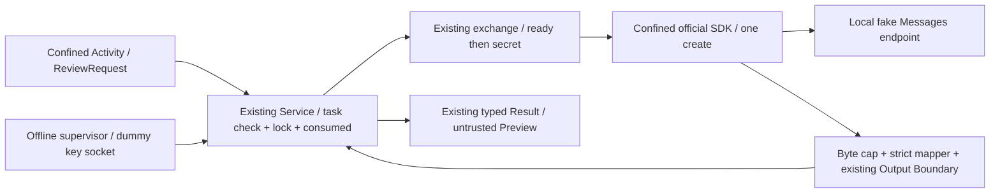

# Anthropic Messages API / Official Client SDK Offline Assessment

**判定: A. Suitable Candidate。ただし採用決定ではなく、Real API RailのHuman Gate候補。**

公式SDKの`max_retries=0`は主要error経路のretryを抑止した。
ただし**それだけでは不十分**で、既定のHTTP redirect追従により307 / 308は2 POSTになる。
公開HTTP client設定`follow_redirects=False`、transport retry=0、明示API key、fresh clientで単一createを
固定した候補では、43ケースすべてでprovider-facing POSTは**最大1回**、補助requestは0だった。
接続成立前のconnection refusedだけは0 POST、HTTP requestを受信した残り42ケースは各1 POST。
接続できなくても必ず1 POSTになるというliteral equalityは成立しないし、要求すべき保証でもない。
本評価で扱うboundedは`0 <= received POST <= 1`であり、成功正常系は1である。

CLIのF-REAL-01は**Openのまま**。Real Claude / Real API Gateは**NO-GO**。
API key生成、setup-token、login、実provider通信、Console課金設定、Real spend、Production、
systemd、1Password、Signer / Wallet、push / PR / publish、External Writeは行っていない。
公開Docsと公式配布物だけをread-only取得した。SDK requestは隔離namespaceのloopbackのみ。

開始実状態: `main` / `999bf8c5a09ebea6217fef9726913c3aff32adf5` / clean。

## SDK / provenance / reversible environment

既存Python環境にanthropic / httpx / pydanticはなく、Repositoryはstdlib中心で依存定義もなかった。
検証専用venv `.local/messages-sdk-20260920/venv`を作成。system-site-packages=false、Python 3.12.3。
環境・pip設定を継承せず、PyPIからwheel限定、cache無効で導入した。global installや恒久依存追加はない。

| 項目 | 実測 / 取得記録 |
| --- | --- |
| Official Python SDK | `anthropic==1.7.0`、各SDK子processでversionを照合 |
| 配布wheel | `anthropic-1.7.0-py3-none-any.whl` |
| SHA-256 | `6b681b6ee00f232bb54f50f9a0d6d30e7be368c1b6f754bfd470c8385b8b6058` |
| HTTP stack | `httpx2==2.13.0`, `httpcore2==2.13.0`, `h11==0.16.0` |
| Parsing | `pydantic==2.13.5`, `pydantic_core==2.46.5`, `jiter==0.17.0` |
| その他 | anyio 4.15.1, docstring_parser 0.18.0, sniffio 1.3.1, typing_extensions 4.16.0, annotated_types 0.8.0, idna 3.20, truststore 0.10.4, typing_inspection 0.4.4 |
| install記録 | `.local/messages-sdk-20260920/install-report.json`。全15 packageのURL / version / wheel SHA-256 |

PyPI公開wheel hashとinstall reportのhashを照合した。PyPIはAnthropic所有・2026-09-18公開・
Trusted Publishing使用と表示している。これは公開配布記録との照合であり、独立した署名bundle検証や
全dependency supply-chain監査を完了したという意味ではない。
[PyPI 1.7.0](https://pypi.org/project/anthropic/1.7.0/)

公式Docsは`max_retries=0`と`http_client`の注入を公開し、この版のHTTP clientは`httpx2`である。
公開拡張点の`DefaultHttpxClient` / `HTTPTransport` / `BaseTransport` / `SyncByteStream`のみをprobeで使用する。
SDK内部sourceは挙動確認のためread-onlyで確認したが、非公開関数を呼ぶ解決策にはしていない。
[公式Python SDK](https://platform.claude.com/docs/en/cli-sdks-libraries/sdks/python)
[HTTPX2 public API](https://pydantic.dev/docs/httpx2/api/api/)

## Profiles / count semantics

全profileにmodel=`claude-sonnet-4-6`、`max_tokens=128`、単一user message、fresh client、
dummy API keyのconstructor引数、空環境、`trust_env=False`、transport retry=0を使用。
tools / server tools / MCP / tool_runner / middleware / count_tokens / files / batchは呼ばない。
HTTPTransportの既定はHTTP/1有効・HTTP/2無効。各Clientは1 create後にcloseする。

| Profile | SDK max_retries | redirect | 用途 |
| --- | ---: | --- | --- |
| sdk-default | 0 | SDK既定のTrue | retry=0だけで残るredirectを比較する対照。環境等まで無設定という意味ではない |
| bounded | 0 | **False** | 採用候補。受信body capと厳格mapperも有効 |
| retry-one | 1 | False | retryが実際に有効になるpositive control |

request timeoutは0.3秒、親exchangeのwall timeoutは8秒。timeout fixture以外のwall killは使わない。
`invocation`は`client.messages.create(...)`を1回呼んだ数。
provider POSTは**fake serverで受信した全POST**であり、redirect先`/redirect-target`のPOSTも含める。
auxiliaryはHEAD / GET等。method dispatch前に全methodを記録し、method / path / 順序 / status、
POSTのmodel / stream / body key名 / dummy認証一致だけを保存。HTTP header本文・body本文は保存しない。

connection refusedではserverを閉じてからinvokeし、受信requestは0。
0を「Realで課金なし」「再実行して安全」と一般化しない。Serviceのattempt消費は成功/失敗で戻さない。

## Fake endpoint matrix

次表は各case・各profileにつき1 invocation。`S`はstream=True、`N`はstream=False。
POST欄に特記しない補助requestは0。

| 経路 | モード | sdk-default POST | bounded POST | bounded結果 |
| --- | --- | ---: | ---: | --- |
| 正常成功 | N / S | 各1 | 各1 | accepted |
| HTTP 401 | N | 1 | 1 | AuthenticationError、拒否 |
| HTTP 404 | N / S | 各1 | 各1 | 拒否、non-streaming fallbackなし |
| HTTP 408 / 409 / 500 | N | 各1 | 各1 | 拒否 |
| HTTP 429 / 529 | N / S | 各1 | 各1 | 拒否 |
| 応答前timeout | N / S | 各1 | 各1 | APITimeoutError、拒否 |
| POST受信後のconnection切断 | N / S | 各1 | 各1 | APIConnectionError、拒否 |
| 接続前connection refused | N | **0** | **0** | APIConnectionError、拒否 |
| malformed JSON | N | 1 | 1 | SDK decode失敗、拒否 |
| 必須field欠落 | N | 1 | 1 | SDKは返すがmapperで拒否 |
| refusal | N / S | 各1 | 各1 | mapperで拒否 |
| tool_use要求 | N | 1 | 1 | mapperで拒否、tool実行なし |
| 301 / 302 / 303 redirect | N | 各1 **+ GET 1** | 各1 | redirectを追跡せず拒否 |
| 307 / 308 redirect | N | **各2** | 各1 | redirectを追跡せず拒否 |
| message_start前SSE overload | S | 1 | 1 | 拒否 |
| message_start直後SSE overload | S | 1 | 1 | 拒否 |
| content delta後SSE overload | S | 1 | 1 | 拒否 |
| message_stop前のSSE終了 | S | 1 | 1 | SDK iterationは完了するがmapperで拒否 |
| malformed SSE JSON | S | 1 | 1 | SDK decode失敗、拒否 |

この基本比較は各profile 32 invocation。HTTP errorには`x-should-retry: true`と短いretry-afterを付けても、
retry=0では追加POSTなし。SSEはSDKの公式stream iteratorを最後まで消費し、その後でcomplete responseを検査した。
truncated SSEは正常なHTTP EOFだがmessage_stopがないfixtureであり、TCP切断は別case。

| 候補profileの追加Output Boundary case（すべてN） | invocation | POST | 結果 |
| --- | ---: | ---: | --- |
| secret plain / JSON escape / base64 | 3 | 3 | secret_withheld |
| lone surrogate / 不正report schema / wrong model / duplicate JSON key | 4 | 4 | malformed_output |
| oversized success body / oversized 500 error body | 2 | 2 | oversized_output |
| gzip encoding | 1 | 1 | encoded_response。decompression前に拒否 |
| 命令風の文字列を含む正しいreport | 1 | 1 | dataとしてaccepted、外部actionなし |

positive controlではretry=1の429 / 529 / connection切断が**各2 POST**。
retry=0で1になることを観測できた。bounded profileにhidden retry / model fallback / transport fallbackは観測されない。

| 実行群 | invocation | POST | auxiliary | 備考 |
| --- | ---: | ---: | ---: | --- |
| sdk-default比較32行 | 32 | 33 | GET 3 | HEAD 0 |
| bounded候補43行 | **43** | **42** | **0** | connection refusedの1行だけ0 POST |
| retry-one対照3行 | 3 | 6 | 0 | 明示的にretryを有効化 |
| matrix計 | **78** | **81** | **GET 3** | その他method 0 |
| Service接続5行 | 5 | 5 | 0 | 下記参照 |
| Service再利用の拒否5回 | 0 | 0 | 0 | SDK起動前に拒否 |
| 初期正常pilot | 1 | 1 | 0 | matrix前の隔離互換性確認 |
| 今回のSDK実行合計 | **84** | **87** | **GET 3** | Real provider 0 |

別枠の既存Claude CLI回帰は20 invocation / 22 POST / HEAD 20。APIのcountに混ぜない。
主要経路の実測は固定SDK・固定依存・固定profile・dummy static keyに対するもの。
将来のversion、async client、HTTP/2、WIF refresh、proxy、tool runner、他API、server内部の推論回数は保証対象外。

## 既存CCWとの接続実測

`tests/messages_api_probe.py`にのみ小さいprototypeを置き、`src/`を変更していない。
既存`runtime_service.serve`のoffline `_execute`注入箇所をtest内でSDK子processへ接続した。
Real permitを偽装したり、`LIVE_BLOCKERS`を解除したりはしていない。



| 部分 | 再利用の実測と残る変更 |
| --- | --- |
| Activity Agent | 既存ReviewRequest / RuntimeClient。credential / endpoint / model / launcher引数を増やさず、隔離processから正常応答と命令風reportを受理 |
| Authorization | offline policyの固定task digest照合を再利用。Real API用contract / permit発行は未実装・未承認。CLI用契約を流用してReal起動しない |
| consumed semantics | 既存lock / durable consumed marker。credential readとSDK起動前に消費。成功2・拒否3の全5行でmarker維持、同じroot再利用拒否、追加POST 0 |
| Secret Handoff | 既存exchangeの匿名socket、ready-before-secret、output budget、known-secret scan、kill/reapを再利用。子process隔離後にdummy API keyをconstructorへ渡す |
| Runtime Service | admission、task選択、single-use、Result framing、safe failure、Evidenceを再利用。SDK実行部だけtest注入 |
| Output Boundary | validated_result / Unicode / schema / exact quote / secret scan / canonical Result budgetを再利用。API envelope→report mapperが新規必要 |
| Evidence | 既存allowlist status / consumed / starts / failure等にSDK版・offline transport識別を追加。prompt / raw API response / credentialは保存しない |
| Human Preview | 既存ReviewResult.preview_text。untrusted_output / display_only / external_actions_executed=falseを検査 |

Service接続caseはsuccess、malformed、secret、oversized、inert-instructions。
ActivityはService rootもkey用FDも受け取らず、preconnected task/result socketだけを使う。
受理2ケースでは同一RuntimeClientによる2回目のreviewも拒否する。
全5caseでServiceの2回目の起動は消費済みとして拒否し、Evidenceを変更せずSDKを起動しない。

**互換性上の明示的な限界:** 現在のprovider enumはCLI / fixture専用である。
今回の合成reportは既存`claude-cli-offline-v1`をoffline互換fixtureとして使う。
SDKをCLIとしてProductionに偽装する案ではない。API採用時にはMessages APIのprovider / runtime_kind識別子、
mapper、code/dependency manifest、credential / cost条件をbindしたcontractの最小追加が必要。
実APIのoptional field、usage、request ID等の完全な受理schemaは未確定で、fixture mapperは意図的に狭い。

## Output Boundary / Security Boundary

候補の受信body capは65,536 bytes、typed Result上限は既存32,768 bytes。
public HTTP transport wrapperでSDK parserより前にbody累積上限を検査し、HTTP error bodyにも適用する。
圧縮bodyは拒否し、展開後の膨張を上限の外へ逃がさない。SDKの型objectはstrict validationの代用品ではない。
responseをstrict decodeし、model / role / stop_reason / content type / usage / JSON duplicate / Unicodeを検査後、
text内reportを既存validated_resultへ渡す。raw API responseがActivityへ流れる経路はない。
SDK exception本文・HTTP header本文・tracebackの本文もEvidenceへ出さない。
SDK logging無効、子stdout/stderrはboundedでknown-secret表現を検査する。

SDK子processはLandlock read-only（stdlib / SDK依存 / public trust roots / 空workspaceのみ）とseccomp。
exec / fork / host file read / file write / UNIX socket作成 / UDP socket作成を全matrix行で拒否するnegative probeを実施。
SDKにはTCPだけを許し、Activityにはsocket作成もconnectも許さない。
Activity用test profileで必要なのは既存接続FD 0へのsendto / recvfromのみ。sendmsg / SCM_RIGHTSは許可しない。
Python socket timeoutに必要なFIONBIO ioctlをtest profileに限定追加した。native CLIの本番profileは未変更。
親死亡SIGKILL、core禁止、CPU 10秒、address space 512 MiB、秘密受渡し前隔離を適用する。

非特権user/net/mount namespaceのloopbackだけで実行し、host root / sudo / host設定変更はない。
matrixのIPv4 TCP SYN宛先がfake port集合内であることを実行中にassertした。
初回runは後段integrationで停止したため、TCP宛先配列はsummaryの最終保存に達していない。
全HTTPのper-row記録は保存済み。全connect syscallやIPv6試行の完全記録とはしない。

この隔離は任意TCPをvendor-onlyにする境界ではない。RealではDNS / TLS / trust rootsの動作、egress方針が残Gate。
信頼するSDK / bootstrapが侵害された場合のrequest数をkernelが1へ制限する仕組みは追加していない。
Python memory zeroization、未隔離同UIDの完全防御、未知encoding / partial-secret / covert channel完全検出も保証しない。
既存Boundaryの限界を、SDK採用だけで解決したとは扱わない。

## Credential Rail

**CLI setup-token / subscription OAuthから、Console API credentialへ変わる。今回使ったのはdummy API keyのみ。**
API keyはconstructor引数で渡し、argv / prompt / environment / fileへ置かない。
この方式なら既存Secret Handoffのsource取得を将来差し替え、Activityから隔離したまま接続できる。
source resolver、実key取得、1Password連携、key自動更新は今回作っていない。

現在の公式Docsではpersonal / service-account keyを単一workspaceへscopeでき、期限を作成時に選べる。
Disable / Delete、expiryによる失効を区別する。無期限keyもあるため「API keyなら短命」とは仮定しない。
24H共有workloadでは個人に依存しないservice-account identityを候補にし、必要なworkspaceだけへ限定する。
これらはDocs確認であり、実accountのUI / role / 利用可能scope / 失効反映を実測したわけではない。
[公式Authentication](https://platform.claude.com/docs/en/manage-claude/authentication)

blast radiusはkeyのidentity / workspace権限 / 有効期間 / spending上限で決まる。
単一workspace scopeは「この1 task、このmodel、POST1回」に束縛するcapabilityではない。
keyを持つSDK processは許可範囲内のAPI利用・課金を悪用し得る。Admin権限・全workspace keyは候補にしない。
revokeは送信済み処理や既発生費用を取り消さない。expiry / 401は自動refresh / 自動再送せずHumanへ停止を返す。
WIFはtoken exchange / refreshという追加通信を伴うため、今回のstatic-key / 1 POST検証の対象外。

## Cost / Spending Gate

Claude SubscriptionとAPI / Consoleは別の課金Rail。
既存subscriptionの利用枠・追加使用OFFをAPIの費用上限として扱わない。
[公式課金説明](https://support.claude.com/en/articles/9876003-i-have-a-paid-claude-subscription-pro-max-team-or-enterprise-plans-why-do-i-have-to-pay-separately-to-use-the-claude-api-and-console)

Real APIへ進む前にHumanが次を確認する必要がある。

1. 使用するorganization / 専用workspace / billing owner、支払い・credit / 自動補充方針。
2. organization / workspaceの明示spend capとalert。既定のtier上限に任せない。
3. 固定model、価格、request/input byte上限、max_tokens、1 execution / 日次 / 月次budget。
4. cost予約とattempt消費を送出前に行い、timeout / 出力拒否でも予約を無条件返却しない。
5. 401 / 429 / spending stop時の停止、取消 / key revoke、Human照合後だけの次の実行。

公式にはworkspace spend / rate limitsがあるがDefault Workspaceは個別limitを設定できない。
[公式Workspaces](https://platform.claude.com/docs/en/manage-claude/workspaces)
spend cap到達時の停止・errorと通常rate limitは区別する。
[公式Rate limits](https://platform.claude.com/docs/en/api/rate-limits)
今回は設定・課金を一切操作していない。POST1回は費用0や固定価格の保証ではない。
`max_tokens=128`もmodel出力側の要求値であり、raw HTTP応答byte上限とは別。
事前`count_tokens`もPOSTなので、1 execution内で追加する設計にはしない。

## Project用途でのCLI比較

| 軸 | Claude Code CLI 2.1.274 | Messages API / SDK 1.7.0候補 |
| --- | --- | --- |
| provider request bounding | early SSE 3、404 2。公式設定でも上限1を実証できず | candidate43行で最大1。受信あり42行=1、接続前失敗=0 |
| retry / fallback | CLI内部再送が残り、成功後に確実に検知できない | retry=0が実効。ただしredirect=Falseも必須。tool runner / auth refreshを使わない |
| credential | setup-token / subscription railの実認証は未検証 | API key rail。constructorへsecret handoff可能。scope / expiry / revoke / spendを新規確認 |
| capability surface | tools / MCP / hooks / workspace / CLAUDE.md等の抑止・互換性確認が必要 | 単一Messages createにはそれらを構成しない。filesystem文脈を自動追加せず、wire bodyは4 keyのみ |
| output mapping | CLI envelopeとJSON text reportを検査 | API envelope / stop_reason / contentからreportを検査。SDK objectの受理だけでは不足 |
| isolation | sealed native binary / native profile / fresh auth home | Python + SDK依存をread-onlyに許可。execとFS write不要。FIONBIO・接続済みActivity FDの小さいprofile適応を実測 |
| cost | subscription / extra usageのHuman確認が必要 | 別API課金。spend cap、token budget、unknown消費照合が必要 |
| operational complexity | native CLI版・設定・auth home・CLI output互換性を管理 | CLI設定面は減るが15 packageとtransport / mapper / TLS / credential rotationを管理 |
| 24H VPS適性 | 1 invocation内の予期しない追加request Risk。常駐・運用は未実測 | 単回process＋既存Serviceに接続可能。無人自動retryを持たせず、expiry / rate limit時停止。24H soak・VPS・daemonは未検証 |
| CCW再利用量 | 既存CLI用接続があるがReal gate停止 | Activity / consumption / handoff / service / validation / evidence / previewを再利用。新transport・mapper・provider enum・contract・cost railが必要 |

「別SDKだから無条件に安全」という評価ではない。tool_runnerやserver toolsを採用すればcapability / request数が変わる。
評価対象は保存資料1件から表示専用reviewを作る、この単一Messages request profileだけである。

現在の`max_attempts: 1` / `automatic_retry: false` / `fallback: false`はCCW自身の
実行・再送・代替選択の契約であり、CLI内部を含むprovider POST単位の保証ではない。
今回もCLIの`provider_requests_hard_cap: null`は変更しない。
APIを採用する場合は、CCWのattempt契約とは別に、固定SDK / transport / redirect設定に対する
`received POST <= 1`の検証済み条件をcontractへ明記する最小修正が必要。
これは侵害済みSDKまで強制するkernel-level hard capとは区別する。

## Findings

| ID | Finding / 扱い |
| --- | --- |
| API-OFF-01 | `max_retries=0`だけではredirectで追加POST / GET。`follow_redirects=False`で抑止を実測。採用条件に固定 |
| API-OFF-02 | SDKは必須field欠落 / 未完了SSEを返すことがある。typed SDK objectやiterator完了を成功保証にしない。strict mapperを必須 |
| API-OFF-03 | 受信byte capはSDK retry設定とは別。success / errorの大bodyとgzipをSDK parse前に拒否するprototypeを実測 |
| API-OFF-04 | provider / runtime_kind enumはCLI専用。offline aliasで再利用検証したが、Real APIへは明示schema追加が必要 |
| F-REAL-01 | CLI固有のOpen blockerを維持。API候補成立でCLI FindingをClosedにしない |

## Tests / Evidence / Git

`python3 -B -m unittest discover -s tests -v`: **119 tests PASS / 50.948秒**。
READMEのisolation check、smoke、B1、Secret Handoff / Boundary / ABC / consumer window、Runtime Service、
real_cli_probeもすべてPASS。既存Secret / Output Boundary、P3、Gate拒否のregressionを維持。

probe全体の初回runは78 matrix行を完了後、Activityの試験用seccompがsocket send/recvを拒否してexit 2。
Service成功caseのrootはconsumed前で、SDK invocation / POSTは0だった。
Activityの既存FD 0だけにsendto/recvfromを許す修正を**1回**行い、integration-onlyを再実行して5ケースPASS。
成功済みmatrixは再実行していない。SDK側経路はこの修正で変更していない。
初回正常pilotはsandboxのnamespace操作拒否後、必要なlocal実行承認経路で1回実行してPASS。
隔離を解除する回避や失敗修正の反復はない。

再現コマンド（専用venvの準備が前提。probe自体はinstallも外部取得もしない）:

```text
python3 -B tests/messages_api_probe.py
python3 -B tests/messages_api_probe.py --integration-only
```

| Evidence | 保存先 |
| --- | --- |
| 最終判定 / 集計 / 失敗と修正の対応 | `.local/messages-api-assessment-20260920.json` |
| 78行の全HTTP観測 / 設定profile / 拒否理由 / isolation結果 | `.local/messages-api-qvgwrdkk/summary.json` |
| 修正後integration 5行 / consumed / 再利用拒否 / safe Evidence | `.local/messages-api-zcpgsmdb/summary.json` |
| 初期正常pilot | `.local/messages-api-0ocisou5/summary.json` |
| SDK配布・依存URL / SHA-256 | `.local/messages-sdk-20260920/install-report.json` |
| 通常 / B1 / Runtime Smoke | `.local/smoke-pskvrh91/`, `.local/b1-smoke-ivatncog/`, `.local/runtime-service-smoke-b7gidwmj/` |
| Secret probes | `.local/secret-handoff-rxm8zd_9/`, `.local/secret-boundary-fp3y0b9m/`, `.local/secret-abc-p2lsw8p_/`, `.local/secret-consumer-window-jp87_fh3/` |
| CLI回帰 | `.local/real-cli-smr85qs9/summary.json` |

```text
matrix summary SHA256: ce3427139b77cdb99261083b269d7c7d5f5b6c51821a78f4d10f5a11e8d246e0
integration summary SHA256: d985a0334010f3826107cc15c2314a5cf943f4f7eb420a5d71a25e10c94feb9c
install report SHA256: dac84b52470680c385a264ddbc0190b279e968432b2f0877e2d009923e473c76
final probe SHA256: 4a8f0e1c927d20b2072ae995886f86b132c58c0742de39a2ed398e9559d1c3bb
```

変更対象は新probe、新報告書、README索引の3ファイル。`src/`、Production、他Repositoryは未変更。
venv / install report / 生成Evidenceはignored `.local/`でcommitしない。差分確認後にlocal commitし、publishしない。

## Human Decision Packet: CLI Risk Acceptance vs Messages API Rail

| Humanの選択 | 受容・確認する事項 | 次の作業範囲 |
| --- | --- | --- |
| CLI継続 + Risk Acceptance | 1 invocation内のPOST数をboundedできないRisk、成功でも内部再送が不明なこと、subscription実認証・追加使用等 | Risk文面とcontract semanticsを明示し、既存残Gateをreview。技術的にF-REAL-01 Closedとはしない |
| Messages API Railを候補として進める | 新API credential / 別課金 / spend cap、SDK依存pin、redirect無効化、出力mapper、isolation適応 | 最小API profile / provider enum / contract / cost gate設計とIndependent Review。実key生成・Console設定・Real1回は別途Human Gate |

**推奨: POST最大1が必須ならMessages API Railの候補化を選ぶ。**
今回の結果はその判断を支えるoffline evidenceであり、API採用・実credential取得・費用発生を許可しない。
Humanの選択までは両Real GateをNO-GOのまま維持する。
